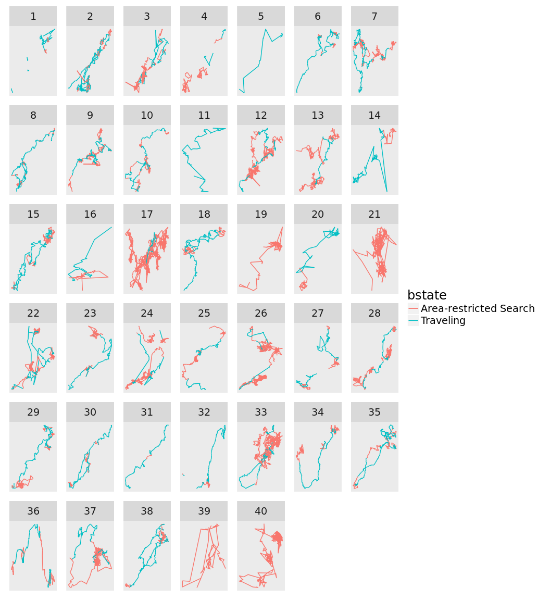
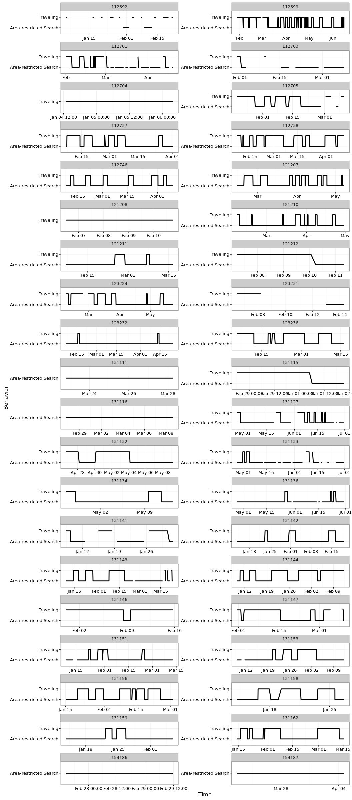
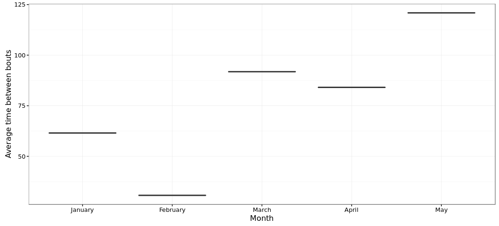

# Dynamic Foraging Patterns in Antarctic Humpbacks
Ben Weinstein  
`r Sys.time()`  


<!-- -->

##By Month

<!-- --><!-- -->

#Correlated random walk

*Process Model*

$$ d_{t} \sim T*d_{t-1} + Normal(0,\Sigma)$$
$$ x_t = x_{t-1} + d_{t} $$

## Parameters

For each individual:

$$\theta = \text{Mean turning angle}$$
$$\gamma = \text{Move persistence} $$

For both behaviors process variance is:
$$ \sigma_{latitude} = 0.1$$
$$ \sigma_{longitude} = 0.1$$

##Behavioral States

$$ \text{For each individual i}$$
$$ Behavior_1 = \text{traveling}$$
$$ Behavior_2 = \text{foraging}$$

$$ \alpha_{i,1,1} = \text{Probability of remaining traveling when traveling}$$
$$\alpha_{i,2,1} = \text{Probability of switching from Foraging to traveling}$$

$$\begin{matrix}
  \alpha_{i,1,1} & 1-\alpha_{i,1,1} \\
  \alpha_{i,2,1} & 1-\alpha_{i,2,1} \\
\end{matrix}$$

With the probability of switching states:

$$logit(\phi_{traveling}) = \alpha_{Behavior_{t-1}}$$

$$\phi_{foraging} = 1 - \phi_{traveling} $$

##Continious tracks

The transmitter will often go dark for 10 to 12 hours, due to weather, right in the middle of an otherwise good track. The model requires regular intervals to estimate the turning angles and temporal autocorrelation. As a track hits one of these walls, call it the end of a track, and begin a new track once the weather improves. We can remove any micro-tracks that are less than three days.
Specify a duration, calculate the number of tracks and the number of removed points. Iteratively.


### After filitering

<!-- -->


How did the filter change the extent of tracks?

<!-- -->

<!-- -->

<!-- --><!-- -->


sink("Bayesian/Multi_RW.jags")
cat("
    model{
    
    #Constants
    pi <- 3.141592653589
    
    #for each if 6 argos class observation error
    
    for(x in 1:6){
    
    ##argos observation error##
    argos_prec[x,1:2,1:2] <- argos_cov[x,,]
    
    #Constructing the covariance matrix
    argos_cov[x,1,1] <- argos_sigma[x]
    argos_cov[x,1,2] <- 0
    argos_cov[x,2,1] <- 0
    argos_cov[x,2,2] <- argos_alpha[x]
    }
    
    for(i in 1:ind){
    for(g in 1:tracks[i]){
    
    ## Priors for first true location
    #for lat long
    y[i,g,1,1:2] ~ dmnorm(argos[i,g,1,1,1:2],argos_prec[1,1:2,1:2])
    
    #First movement - random walk.
    y[i,g,2,1:2] ~ dmnorm(y[i,g,1,1:2],iSigma)
    
    ###First Behavioral State###
    state[i,g,1] ~ dcat(lambda[]) ## assign state for first obs
    
    #Process Model for movement
    for(t in 2:(steps[i,g]-1)){
    
    #Behavioral State at time T
    logit(phi[i,g,t,1]) <- alpha_mu[state[i,g,t-1],Month[i,g,t]] 
    phi[i,g,t,2] <- 1-phi[i,g,t,1]
    state[i,g,t] ~ dcat(phi[i,g,t,])
    
    #Turning covariate
    #Transition Matrix for turning angles
    T[i,g,t,1,1] <- cos(theta[state[i,g,t]])
    T[i,g,t,1,2] <- (-sin(theta[state[i,g,t]]))
    T[i,g,t,2,1] <- sin(theta[state[i,g,t]])
    T[i,g,t,2,2] <- cos(theta[state[i,g,t]])
    
    #Correlation in movement change
    d[i,g,t,1:2] <- y[i,g,t,] + gamma[state[i,g,t],Month[i,g,t]] * T[i,g,t,,] %*% (y[i,g,t,1:2] - y[i,g,t-1,1:2])
    
    #Gaussian Displacement
    y[i,g,t+1,1:2] ~ dmnorm(d[i,g,t,1:2],iSigma)
    }
    
    #Final behavior state
    logit(phi[i,g,steps[i,g],1]) <- alpha_mu[state[i,g,steps[i,g]-1],Month[i,g,steps[i,g]-1]] 
    phi[i,g,steps[i,g],2] <- 1-phi[i,g,steps[i,g],1]
    state[i,g,steps[i,g]] ~ dcat(phi[i,g,steps[i,g],])
    
    ##	Measurement equation - irregular observations
    # loops over regular time intervals (t)    
    
    for(t in 2:steps[i,g]){
    
    # loops over observed locations within interval t
    for(u in 1:idx[i,g,t]){ 
    zhat[i,g,t,u,1:2] <- (1-j[i,g,t,u]) * y[i,g,t-1,1:2] + j[i,g,t,u] * y[i,g,t,1:2]
    
    #for each lat and long
    #argos error
    argos[i,g,t,u,1:2] ~ dmnorm(zhat[i,g,t,u,1:2],argos_prec[argos_class[i,g,t,u],1:2,1:2])
    }
    }
    }
    }
    ###Priors###
    
    #Process Variance
    iSigma ~ dwish(R,2)
    Sigma <- inverse(iSigma)
    
    ##Mean Angle
    tmp[1] ~ dbeta(10, 10)
    tmp[2] ~ dbeta(10, 10)
    
    # prior for theta in 'traveling state'
    theta[1] <- (2 * tmp[1] - 1) * pi
    
    # prior for theta in 'foraging state'    
    theta[2] <- (tmp[2] * pi * 2)
    
    ##Move persistance
    # prior for gamma (autocorrelation parameter) in state 1

    #for each month
    for (m in 1:Months){

    #Intercepts
    alpha_mu[1,m] ~ dnorm(0,0.386)
    alpha_mu[2,m] ~ dnorm(0,0.386)
    
    gamma[1,m] ~ dunif(0.6,1)		## gamma for state 1
    dev[m] ~ dbeta(1,1)			## a random deviate to ensure that gamma[1] > gamma[2]
    gamma[2,m] <- gamma[1,m] * dev[m]	## gamma for state 2
    }
    
    ##Behavioral States
    
    #Hierarchical structure across motnhs
    
    #Variance
    alpha_tau[1] ~ dt(0,1,1)I(0,)
    alpha_tau[2] ~ dt(0,1,1)I(0,)
    
    #Probability of behavior switching 
    lambda[1] ~ dbeta(1,1)
    lambda[2] <- 1 - lambda[1]
    
    ##Argos priors##
    #longitudinal argos precision, from Jonsen 2005, 2016, represented as precision not sd
    
    #by argos class
    argos_sigma[1] <- 11.9016
    argos_sigma[2] <- 10.2775
    argos_sigma[3] <- 1.228984
    argos_sigma[4] <- 2.162593
    argos_sigma[5] <- 3.885832
    argos_sigma[6] <- 0.0565539
    
    #latitidunal argos precision, from Jonsen 2005, 2016
    argos_alpha[1] <- 67.12537
    argos_alpha[2] <- 14.73474
    argos_alpha[3] <- 4.718973
    argos_alpha[4] <- 0.3872023
    argos_alpha[5] <- 3.836444
    argos_alpha[6] <- 0.1081156
    
    
    }"
    ,fill=TRUE)
sink()


```
##      user    system   elapsed 
##   343.358     3.584 33038.047
```


##Chains

```
##             used   (Mb) gc trigger   (Mb)  max used   (Mb)
## Ncells   1512755   80.8    3886542  207.6   3886542  207.6
## Vcells 397431035 3032.2  889956387 6789.9 765594135 5841.1
```

```
##            used (Mb) gc trigger   (Mb)  max used   (Mb)
## Ncells  1348159   72    3886542  207.6   3886542  207.6
## Vcells 53212776  406  711965109 5431.9 765594135 5841.1
```

<!-- --><!-- -->


<!-- -->

## Change in autocorrelation over time

<!-- --><!-- -->

# Change in transition probabilities over time

<!-- --><!-- -->

## Parameter Summary


```
##    parameter           par       mean       lower      upper
## 1   alpha_mu alpha_mu[1,1]  2.3478796  1.49103170  3.1860180
## 2   alpha_mu alpha_mu[2,1] -2.5732266 -3.34357970 -1.8701620
## 3   alpha_mu alpha_mu[1,2]  2.5184411  2.02207777  2.9988844
## 4   alpha_mu alpha_mu[2,2] -2.7407313 -3.16547860 -2.3159538
## 5   alpha_mu alpha_mu[1,3]  2.7485979  1.90527038  3.5033641
## 6   alpha_mu alpha_mu[2,3] -3.1024609 -3.77030779 -2.5111170
## 7   alpha_mu alpha_mu[1,4]  2.1634001  1.22066193  3.1752907
## 8   alpha_mu alpha_mu[2,4] -2.5104508 -3.42676321 -1.6923341
## 9   alpha_mu alpha_mu[1,5]  2.7062488  1.69736137  3.7461721
## 10  alpha_mu alpha_mu[2,5] -2.7024845 -3.71769957 -1.6740279
## 11     gamma    gamma[1,1]  0.8793497  0.79203012  0.9775155
## 12     gamma    gamma[2,1]  0.5632432  0.14596396  0.8483072
## 13     gamma    gamma[1,2]  0.7692441  0.69535048  0.8509218
## 14     gamma    gamma[2,2]  0.5105311  0.19852238  0.7381559
## 15     gamma    gamma[1,3]  0.6911617  0.60750825  0.8116130
## 16     gamma    gamma[2,3]  0.4602625  0.19512060  0.6455024
## 17     gamma    gamma[1,4]  0.8381944  0.71248679  0.9749967
## 18     gamma    gamma[2,4]  0.4895126  0.10297641  0.7780098
## 19     gamma    gamma[1,5]  0.9152226  0.84402022  0.9860971
## 20     gamma    gamma[2,5]  0.6785520  0.31828306  0.8957414
## 21     theta      theta[1]  1.5004106 -0.00145625  3.0323655
## 22     theta      theta[2]  1.6156789  0.04228479  3.3169656
```

<!-- -->

#Behavioral Prediction


<!-- -->

##Spatial Prediction

<!-- --><!-- --><!-- -->

## By individual

<!-- -->

##Autocorrelation in behavior

<!-- -->

#Simulated tracks

<!-- -->

##Behavioral description

## Predicted behavior duration


<!-- -->

## Duration by month

<!-- --><!-- -->

#Proportion of states by month

<!-- --><!-- -->

#Time between foraging bouts

<!-- --><!-- --><!-- -->

#Distance between bouts

<!-- -->

#Time spent in grid cell

<!-- --><!-- --><!-- -->


