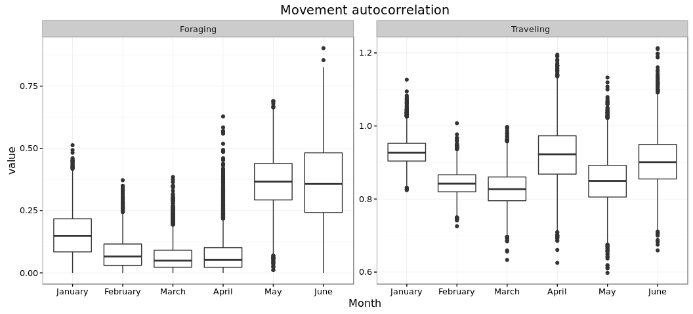
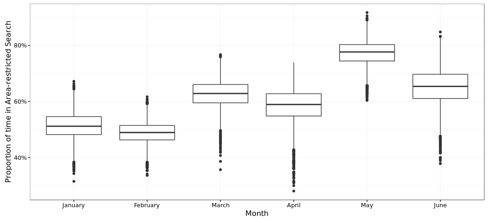

# Dynamic Foraging Patterns in Antarctic Humpbacks
Ben Weinstein  
`r Sys.time()`  


```
## # A tibble: 2 × 2
##   Animal `max(timestamp, na.rm = T)`
##    <int>                      <dttm>
## 1 123232         2013-09-28 07:28:00
## 2 123236         2013-03-18 11:26:00
```

<!-- -->

##By Month

<!-- --><!-- -->

#Correlated random walk

*Process Model*

$$ d_{t} \sim T*d_{t-1} + Normal(0,\Sigma)$$
$$ x_t = x_{t-1} + d_{t} $$

## Parameters

For each individual:

$$\theta = \text{Mean turning angle}$$
$$\gamma = \text{Move persistence} $$

For both behaviors process variance is:
$$ \sigma_{latitude} = 0.1$$
$$ \sigma_{longitude} = 0.1$$

##Behavioral States

$$ \text{For each individual i}$$
$$ Behavior_1 = \text{traveling}$$
$$ Behavior_2 = \text{foraging}$$

$$ \alpha_{i,1,1} = \text{Probability of remaining traveling when traveling}$$
$$\alpha_{i,2,1} = \text{Probability of switching from Foraging to traveling}$$

$$\begin{matrix}
  \alpha_{i,1,1} & 1-\alpha_{i,1,1} \\
  \alpha_{i,2,1} & 1-\alpha_{i,2,1} \\
\end{matrix}$$

With the probability of switching states:

$$logit(\phi_{traveling}) = \alpha_{Behavior_{t-1}}$$

$$\phi_{foraging} = 1 - \phi_{traveling} $$

##Continious tracks

The transmitter will often go dark for 10 to 12 hours, due to weather, right in the middle of an otherwise good track. The model requires regular intervals to estimate the turning angles and temporal autocorrelation. As a track hits one of these walls, call it the end of a track, and begin a new track once the weather improves. We can remove any micro-tracks that are less than three days.
Specify a duration, calculate the number of tracks and the number of removed points. Iteratively.


### After filitering

<!-- -->


How did the filter change the extent of tracks?

<!-- -->

<!-- -->

<!-- --><!-- -->


sink("Bayesian/Multi_RW.jags")
cat("
    model{
    
    #Constants
    pi <- 3.141592653589
    
    #for each if 6 argos class observation error
    
    for(x in 1:6){
    
    ##argos observation error##
    argos_prec[x,1:2,1:2] <- argos_cov[x,,]
    
    #Constructing the covariance matrix
    argos_cov[x,1,1] <- argos_sigma[x]
    argos_cov[x,1,2] <- 0
    argos_cov[x,2,1] <- 0
    argos_cov[x,2,2] <- argos_alpha[x]
    }
    
    for(i in 1:ind){
    for(g in 1:tracks[i]){
    
    ## Priors for first true location
    #for lat long
    y[i,g,1,1:2] ~ dmnorm(argos[i,g,1,1,1:2],argos_prec[1,1:2,1:2])
    
    #First movement - random walk.
    y[i,g,2,1:2] ~ dmnorm(y[i,g,1,1:2],iSigma)
    
    ###First Behavioral State###
    state[i,g,1] ~ dcat(lambda[]) ## assign state for first obs
    
    #Process Model for movement
    for(t in 2:(steps[i,g]-1)){
    
    #Behavioral State at time T
    phi[i,g,t,1] <- alpha[state[i,g,t-1],Month[i,g,t]] 
    phi[i,g,t,2] <- 1-phi[i,g,t,1]
    state[i,g,t] ~ dcat(phi[i,g,t,])
    
    #Turning covariate
    #Transition Matrix for turning angles
    T[i,g,t,1,1] <- cos(theta[state[i,g,t]])
    T[i,g,t,1,2] <- (-sin(theta[state[i,g,t]]))
    T[i,g,t,2,1] <- sin(theta[state[i,g,t]])
    T[i,g,t,2,2] <- cos(theta[state[i,g,t]])
    
    #Correlation in movement change
    d[i,g,t,1:2] <- y[i,g,t,] + gamma[state[i,g,t],Month[i,g,t]] * T[i,g,t,,] %*% (y[i,g,t,1:2] - y[i,g,t-1,1:2])
    
    #Gaussian Displacement
    y[i,g,t+1,1:2] ~ dmnorm(d[i,g,t,1:2],iSigma)
    }
    
    #Final behavior state
    phi[i,g,steps[i,g],1] <- alpha[state[i,g,steps[i,g]-1],Month[i,g,steps[i,g]-1]] 
    phi[i,g,steps[i,g],2] <- 1-phi[i,g,steps[i,g],1]
    state[i,g,steps[i,g]] ~ dcat(phi[i,g,steps[i,g],])
    
    ##	Measurement equation - irregular observations
    # loops over regular time intervals (t)    
    
    for(t in 2:steps[i,g]){
    
    # loops over observed locations within interval t
    for(u in 1:idx[i,g,t]){ 
    zhat[i,g,t,u,1:2] <- (1-j[i,g,t,u]) * y[i,g,t-1,1:2] + j[i,g,t,u] * y[i,g,t,1:2]
    
    #for each lat and long
    #argos error
    argos[i,g,t,u,1:2] ~ dmnorm(zhat[i,g,t,u,1:2],argos_prec[argos_class[i,g,t,u],1:2,1:2])
    }
    }
    }
    }
    ###Priors###
    
    #Process Variance
    iSigma ~ dwish(R,2)
    Sigma <- inverse(iSigma)
    
    ##Mean Angle
    tmp[1] ~ dbeta(10, 10)
    tmp[2] ~ dbeta(10, 10)
    
    # prior for theta in 'traveling state'
    theta[1] <- (2 * tmp[1] - 1) * pi
    
    # prior for theta in 'foraging state'    
    theta[2] <- (tmp[2] * pi * 2)
    
    ##Move persistance
    # prior for gamma (autocorrelation parameter) in state 1

    #for each month
    for (m in 1:Months){

      #Intercepts
      logit(alpha[1,m]) <- alpha_mu_invlogit[1,m]
      alpha_mu_invlogit[1,m] ~ dnorm(alpha_mu[1],alpha_tau[1])
      
      logit(alpha[2,m]) <- alpha_mu_invlogit[2,m]
      alpha_mu_invlogit[2,m] ~ dnorm(alpha_mu[2],alpha_tau[2])
      
      gamma[1,m] ~ dnorm(gamma_mu,gamma_tau)		## gamma for state 1
      dev[m] ~ dbeta(1,1)			## a random deviate to ensure that gamma[1] > gamma[2]
      gamma[2,m] <- gamma[1,m] * dev[m]
    }
    
    ##Behavioral States
    
    #Hierarchical structure across months
    
    #Switching among states in inv.logit space
    alpha_mu[1] ~ dnorm(0,0.386)
    alpha_mu[2] ~ dnorm(0,0.386)

    #Variance in state change per month
    alpha_tau[1] ~ dgamma(0.0001,0.0001)
    alpha_tau[2] ~ dgamma(0.0001,0.0001)
    
    #spatial autocorrelation prior, we know that it has higher autocorrelation than state 2
    gamma_mu ~ dnorm(0.8,500)
    
    #variance in gamma per month
    gamma_tau ~ dgamma(0.0001,0.0001)

    #Probability of behavior switching 
    lambda[1] ~ dbeta(1,1)
    lambda[2] <- 1 - lambda[1]
    
    ##Argos priors##
    #longitudinal argos precision, from Jonsen 2005, 2016, represented as precision not sd
    
    #by argos class
    argos_sigma[1] <- 11.9016
    argos_sigma[2] <- 10.2775
    argos_sigma[3] <- 1.228984
    argos_sigma[4] <- 2.162593
    argos_sigma[5] <- 3.885832
    argos_sigma[6] <- 0.0565539
    
    #latitidunal argos precision, from Jonsen 2005, 2016
    argos_alpha[1] <- 67.12537
    argos_alpha[2] <- 14.73474
    argos_alpha[3] <- 4.718973
    argos_alpha[4] <- 0.3872023
    argos_alpha[5] <- 3.836444
    argos_alpha[6] <- 0.1081156
    
    
    }"
    ,fill=TRUE)
sink()


```
##    user  system elapsed 
##    3.14    1.36  312.33
```


##Chains

```
##            used (Mb) gc trigger  (Mb) max used  (Mb)
## Ncells  1338933 71.6    2637877 140.9  2637877 140.9
## Vcells 10281792 78.5   28941810 220.9 46990700 358.6
```

```
##           used (Mb) gc trigger  (Mb) max used  (Mb)
## Ncells 1331479 71.2    2637877 140.9  2637877 140.9
## Vcells 6799917 51.9   23153448 176.7 46990700 358.6
```

<!-- --><!-- -->


<!-- -->

## Change in autocorrelation over time

<!-- --><!-- -->

# Change in transition probabilities over time

<!-- --><!-- -->

## Parameter Summary


```
##    parameter          par          mean         lower        upper
## 1      alpha   alpha[1,1]    0.65211986  5.404306e-01    0.8517767
## 2      alpha   alpha[2,1]    0.61082579  1.465187e-01    0.9999966
## 3      alpha   alpha[1,2]    0.67527356  5.657484e-01    0.8526467
## 4      alpha   alpha[2,2]    0.14329323  1.560355e-05    0.2967653
## 5      alpha   alpha[1,3]    0.63383094  4.394857e-01    0.8348255
## 6      alpha   alpha[2,3]    0.15557480  1.468828e-02    0.2824026
## 7      alpha   alpha[1,4]    0.65161435  5.454670e-01    0.8181779
## 8      alpha   alpha[2,4]    0.13547877  7.162426e-08    0.3033733
## 9   alpha_mu  alpha_mu[1]    0.66103027  1.965716e-01    1.5889844
## 10  alpha_mu  alpha_mu[2]   -0.70449681 -1.938750e+00    1.7254560
## 11 alpha_tau alpha_tau[1] 1543.05694105  1.375895e+00 9363.6339378
## 12 alpha_tau alpha_tau[2] 1035.99819039  5.499725e-03 6628.2267366
## 13     gamma   gamma[1,1]    0.36460916 -1.519343e-01    0.7647826
## 14     gamma   gamma[2,1]    0.17093458 -7.931959e-02    0.4782040
## 15     gamma   gamma[1,2]    0.01420102 -9.308402e-01    0.8699413
## 16     gamma   gamma[2,2]   -0.21302089 -6.213377e-01    0.2545191
## 17     gamma   gamma[1,3]    0.68965269  4.821787e-01    0.9611908
## 18     gamma   gamma[2,3]    0.21915097  4.543892e-02    0.4227511
## 19     gamma   gamma[1,4]    0.38866293 -4.070012e-01    1.1727539
## 20     gamma   gamma[2,4]    0.12357352 -1.453662e-01    0.4255142
## 21  gamma_mu     gamma_mu    0.77990701  7.047316e-01    0.8667016
## 22 gamma_tau    gamma_tau   91.50130912  2.730430e-01  539.6248497
## 23     theta     theta[1]    0.06008947 -1.086422e-01    0.1956118
## 24     theta     theta[2]    3.13793313  2.706122e+00    3.4130639
```

<!-- -->

#Behavioral Prediction


<!-- -->

##Spatial Prediction

<!-- --><!-- --><!-- -->

## By individual

<!-- -->

##Autocorrelation in behavior

<!-- -->

### As single timeline

<!-- -->

#Simulated tracks

<!-- -->

##Behavioral description

###Proportion of states by month

<!-- --><!-- -->

###Distance between bouts

<!-- --><!-- -->

#Behavior duration


```
## Source: local data frame [7 x 7]
## Groups: Animal, Track, Bout, phistate [7]
## 
##   Animal Track  Bout  phistate MonthF       Days    Month
##    <dbl> <dbl> <int>    <fctr>  <dbl>      <dbl>   <fctr>
## 1      4     1     1 Traveling      1 22.9841898  January
## 2      3     1     1 Traveling      1 18.8980208  January
## 3      2     1     4 Traveling      3  3.4944444    March
## 4      1     1     3 Traveling      3  0.9847222    March
## 5      1     1     5 Traveling      4  0.4659722    April
## 6      1     1     1 Traveling      2  0.3548611 February
## 7      2     1     2 Traveling      3  0.3215278    March
```

```
## Source: local data frame [12 x 7]
## Groups: Animal, Track, Bout, phistate [12]
## 
##    Animal Track  Bout               phistate MonthF       Days    Month
##     <dbl> <dbl> <int>                 <fctr>  <dbl>      <dbl>   <fctr>
## 1       1     1     2 Area-restricted Search      2 40.2013889 February
## 2       2     1     1 Area-restricted Search      2 23.3729167 February
## 3       4     1     2 Area-restricted Search      2 23.0990046 February
## 4       1     1     6 Area-restricted Search      4 22.2701389    April
## 5       4     2     1 Area-restricted Search      2 18.9131829 February
## 6       3     1     2 Area-restricted Search      2 17.2529514 February
## 7       1     1     4 Area-restricted Search      3 10.9611111    March
## 8       2     1     3 Area-restricted Search      3  5.8590278    March
## 9       2     1     5 Area-restricted Search      3  4.4194444    March
## 10      4     4     1 Area-restricted Search      3  1.3696991    March
## 11      4     5     1 Area-restricted Search      3  1.0939931    March
## 12      4     3     1 Area-restricted Search      3  0.6460301    March
```

```
## Source: local data frame [19 x 7]
## Groups: Animal, Track, Bout, phistate [19]
## 
##    Animal Track  Bout               phistate MonthF       Days    Month
##     <dbl> <dbl> <int>                 <fctr>  <dbl>      <dbl>   <fctr>
## 1       1     1     1              Traveling      2  0.3548611 February
## 2       1     1     2 Area-restricted Search      2 40.2013889 February
## 3       1     1     3              Traveling      3  0.9847222    March
## 4       1     1     4 Area-restricted Search      3 10.9611111    March
## 5       1     1     5              Traveling      4  0.4659722    April
## 6       1     1     6 Area-restricted Search      4 22.2701389    April
## 7       2     1     1 Area-restricted Search      2 23.3729167 February
## 8       2     1     2              Traveling      3  0.3215278    March
## 9       2     1     3 Area-restricted Search      3  5.8590278    March
## 10      2     1     4              Traveling      3  3.4944444    March
## 11      2     1     5 Area-restricted Search      3  4.4194444    March
## 12      3     1     1              Traveling      1 18.8980208  January
## 13      3     1     2 Area-restricted Search      2 17.2529514 February
## 14      4     1     1              Traveling      1 22.9841898  January
## 15      4     1     2 Area-restricted Search      2 23.0990046 February
## 16      4     2     1 Area-restricted Search      2 18.9131829 February
## 17      4     3     1 Area-restricted Search      3  0.6460301    March
## 18      4     4     1 Area-restricted Search      3  1.3696991    March
## 19      4     5     1 Area-restricted Search      3  1.0939931    March
```

<!-- -->

##Proportion of time allocation
<!-- -->

```
##      Month  Traveling Area-restricted Search     PropF TotalTime
## 1  January 41.8822106                0.00000 0.0000000  41.88221
## 2 February  0.3548611              122.83944 0.9971195 123.19431
## 3    March  4.8006944               24.34931 0.8353107  29.15000
## 4    April  0.4659722               22.27014 0.9795052  22.73611
```

## Number of bouts

<!-- -->

#Time spent in grid cell
## All years
<!-- --><!-- --><!-- -->

##Add in sea ice

<!-- -->


