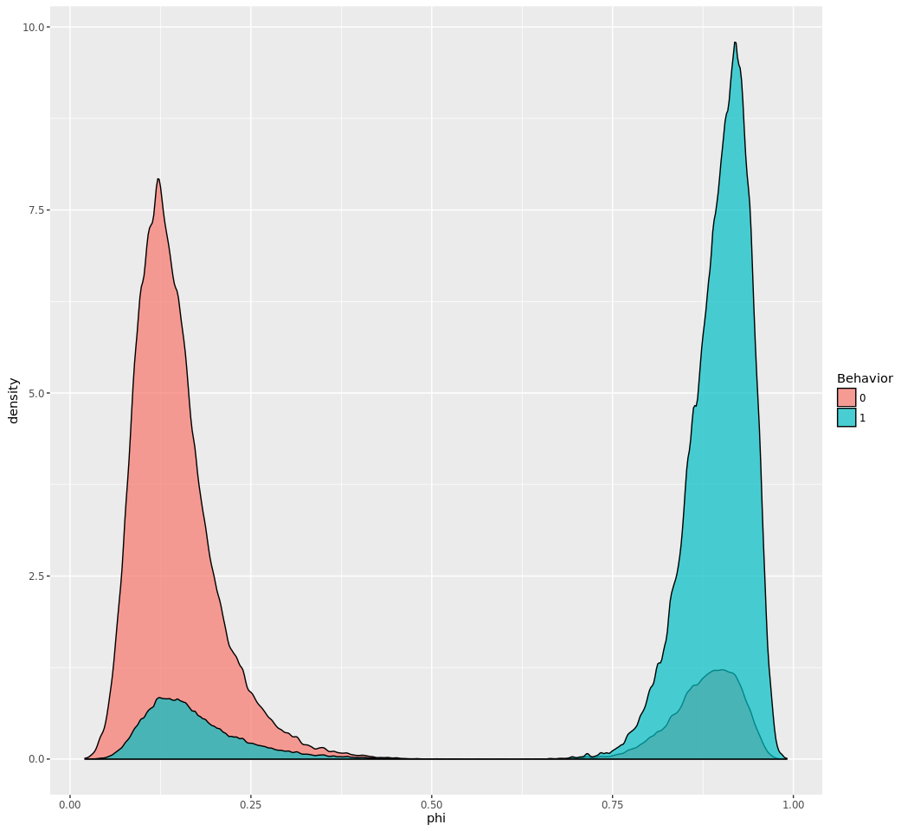
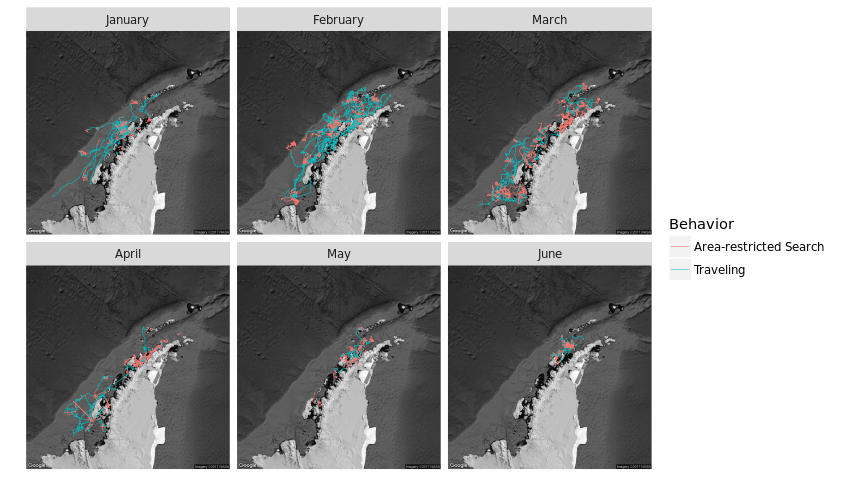
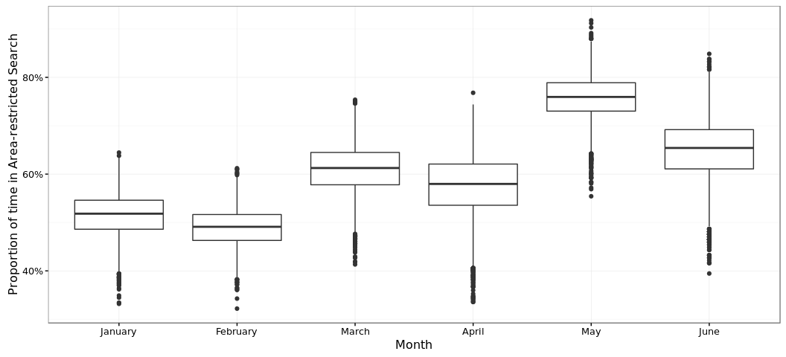
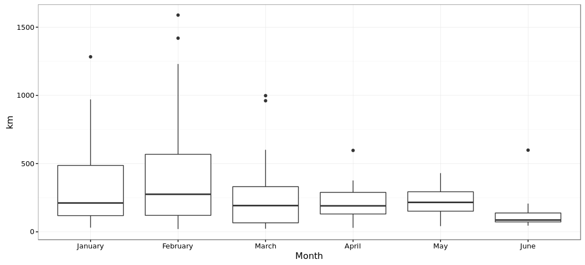
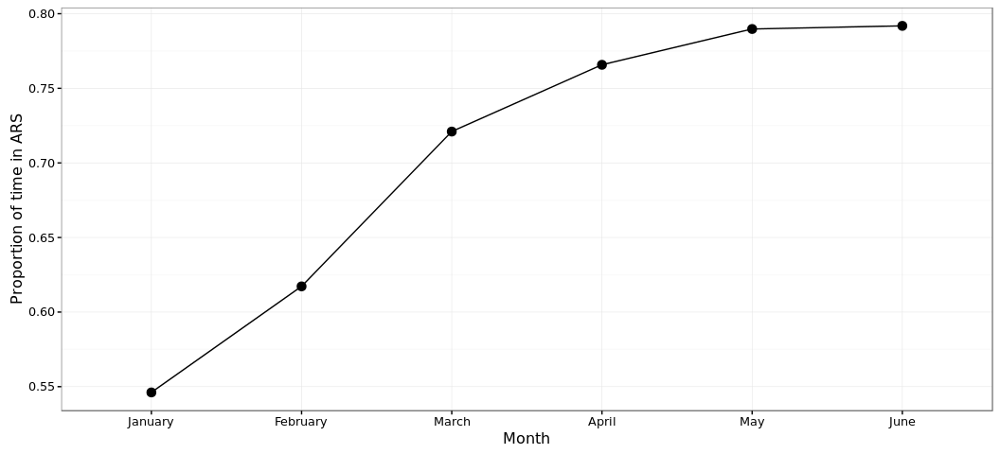
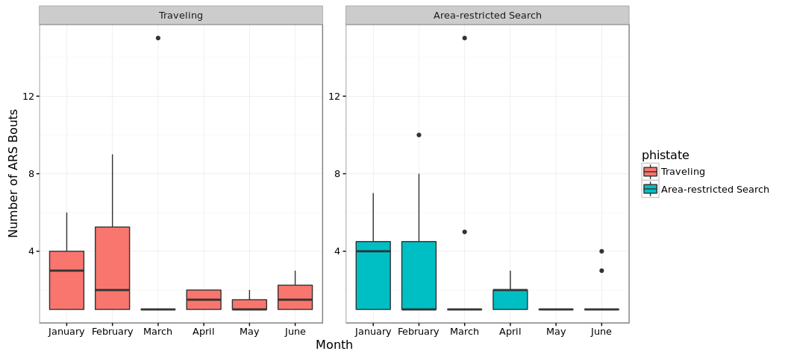

# Dynamic Foraging Patterns in Antarctic Humpbacks
Ben Weinstein  
`r Sys.time()`  


```
## Source: local data frame [12 x 2]
## 
##    Animal max(timestamp, na.rm = T)
##     (int)                    (time)
## 1  112699       2012-06-17 03:57:31
## 2  121207       2013-05-09 18:49:00
## 3  121208       2013-02-18 07:52:00
## 4  121210       2013-05-05 07:44:00
## 5  123224       2013-05-24 12:13:00
## 6  123232       2013-09-28 07:28:00
## 7  123236       2013-03-18 11:26:00
## 8  131127       2016-07-15 07:58:36
## 9  131130       2016-04-30 00:30:06
## 10 131132       2016-05-10 19:44:39
## 11 131133       2016-07-05 20:26:44
## 12 131136       2016-06-30 18:49:35
```

<!-- -->

##By Month

<!-- --><!-- -->

#Correlated random walk

*Process Model*

$$ d_{t} \sim T*d_{t-1} + Normal(0,\Sigma)$$
$$ x_t = x_{t-1} + d_{t} $$

## Parameters

For each individual:

$$\theta = \text{Mean turning angle}$$
$$\gamma = \text{Move persistence} $$

For both behaviors process variance is:
$$ \sigma_{latitude} = 0.1$$
$$ \sigma_{longitude} = 0.1$$

##Behavioral States

$$ \text{For each individual i}$$
$$ Behavior_1 = \text{traveling}$$
$$ Behavior_2 = \text{foraging}$$

$$ \alpha_{i,1,1} = \text{Probability of remaining traveling when traveling}$$
$$\alpha_{i,2,1} = \text{Probability of switching from Foraging to traveling}$$

$$\begin{matrix}
  \alpha_{i,1,1} & 1-\alpha_{i,1,1} \\
  \alpha_{i,2,1} & 1-\alpha_{i,2,1} \\
\end{matrix}$$

With the probability of switching states:

$$logit(\phi_{traveling}) = \alpha_{Behavior_{t-1}}$$

$$\phi_{foraging} = 1 - \phi_{traveling} $$

##Continious tracks

The transmitter will often go dark for 10 to 12 hours, due to weather, right in the middle of an otherwise good track. The model requires regular intervals to estimate the turning angles and temporal autocorrelation. As a track hits one of these walls, call it the end of a track, and begin a new track once the weather improves. We can remove any micro-tracks that are less than three days.
Specify a duration, calculate the number of tracks and the number of removed points. Iteratively.


### After filitering

<!-- -->


How did the filter change the extent of tracks?

<!-- -->

<!-- -->

<!-- --><!-- -->


sink("Bayesian/Multi_RW.jags")
cat("
    model{
    
    #Constants
    pi <- 3.141592653589
    
    #for each if 6 argos class observation error
    
    for(x in 1:6){
    
    ##argos observation error##
    argos_prec[x,1:2,1:2] <- argos_cov[x,,]
    
    #Constructing the covariance matrix
    argos_cov[x,1,1] <- argos_sigma[x]
    argos_cov[x,1,2] <- 0
    argos_cov[x,2,1] <- 0
    argos_cov[x,2,2] <- argos_alpha[x]
    }
    
    for(i in 1:ind){
    for(g in 1:tracks[i]){
    
    ## Priors for first true location
    #for lat long
    y[i,g,1,1:2] ~ dmnorm(argos[i,g,1,1,1:2],argos_prec[1,1:2,1:2])
    
    #First movement - random walk.
    y[i,g,2,1:2] ~ dmnorm(y[i,g,1,1:2],iSigma)
    
    ###First Behavioral State###
    state[i,g,1] ~ dcat(lambda[]) ## assign state for first obs
    
    #Process Model for movement
    for(t in 2:(steps[i,g]-1)){
    
    #Behavioral State at time T
    phi[i,g,t,1] <- alpha_mu[state[i,g,t-1],Month[i,g,t]] 
    phi[i,g,t,2] <- 1-phi[i,g,t,1]
    state[i,g,t] ~ dcat(phi[i,g,t,])
    
    #Turning covariate
    #Transition Matrix for turning angles
    T[i,g,t,1,1] <- cos(theta[state[i,g,t]])
    T[i,g,t,1,2] <- (-sin(theta[state[i,g,t]]))
    T[i,g,t,2,1] <- sin(theta[state[i,g,t]])
    T[i,g,t,2,2] <- cos(theta[state[i,g,t]])
    
    #Correlation in movement change
    d[i,g,t,1:2] <- y[i,g,t,] + gamma[state[i,g,t],Month[i,g,t]] * T[i,g,t,,] %*% (y[i,g,t,1:2] - y[i,g,t-1,1:2])
    
    #Gaussian Displacement
    y[i,g,t+1,1:2] ~ dmnorm(d[i,g,t,1:2],iSigma)
    }
    
    #Final behavior state
    phi[i,g,steps[i,g],1] <- alpha_mu[state[i,g,steps[i,g]-1],Month[i,g,steps[i,g]-1]] 
    phi[i,g,steps[i,g],2] <- 1-phi[i,g,steps[i,g],1]
    state[i,g,steps[i,g]] ~ dcat(phi[i,g,steps[i,g],])
    
    ##	Measurement equation - irregular observations
    # loops over regular time intervals (t)    
    
    for(t in 2:steps[i,g]){
    
    # loops over observed locations within interval t
    for(u in 1:idx[i,g,t]){ 
    zhat[i,g,t,u,1:2] <- (1-j[i,g,t,u]) * y[i,g,t-1,1:2] + j[i,g,t,u] * y[i,g,t,1:2]
    
    #for each lat and long
    #argos error
    argos[i,g,t,u,1:2] ~ dmnorm(zhat[i,g,t,u,1:2],argos_prec[argos_class[i,g,t,u],1:2,1:2])
    }
    }
    }
    }
    ###Priors###
    
    #Process Variance
    iSigma ~ dwish(R,2)
    Sigma <- inverse(iSigma)
    
    ##Mean Angle
    tmp[1] ~ dbeta(10, 10)
    tmp[2] ~ dbeta(10, 10)
    
    # prior for theta in 'traveling state'
    theta[1] <- (2 * tmp[1] - 1) * pi
    
    # prior for theta in 'foraging state'    
    theta[2] <- (tmp[2] * pi * 2)
    
    ##Move persistance
    # prior for gamma (autocorrelation parameter) in state 1

    #for each month
    for (m in 1:Months){

      #Intercepts
      alpha_mu[1,m] ~ dbeta(1,1)
      alpha_mu[2,m] ~ dbeta(1,1)
      
      gamma[1,m] ~ dbeta(3,2)		## gamma for state 1
      dev[m] ~ dbeta(1,1)			## a random deviate to ensure that gamma[1] > gamma[2]
      gamma[2,m] <- gamma[1,m] * dev[m]
    }
    
    ##Behavioral States
    
    #Hierarchical structure across motnhs
    
    #Variance
    alpha_tau[1] ~ dt(0,1,1)I(0,)
    alpha_tau[2] ~ dt(0,1,1)I(0,)
    
    #Probability of behavior switching 
    lambda[1] ~ dbeta(1,1)
    lambda[2] <- 1 - lambda[1]
    
    ##Argos priors##
    #longitudinal argos precision, from Jonsen 2005, 2016, represented as precision not sd
    
    #by argos class
    argos_sigma[1] <- 11.9016
    argos_sigma[2] <- 10.2775
    argos_sigma[3] <- 1.228984
    argos_sigma[4] <- 2.162593
    argos_sigma[5] <- 3.885832
    argos_sigma[6] <- 0.0565539
    
    #latitidunal argos precision, from Jonsen 2005, 2016
    argos_alpha[1] <- 67.12537
    argos_alpha[2] <- 14.73474
    argos_alpha[3] <- 4.718973
    argos_alpha[4] <- 0.3872023
    argos_alpha[5] <- 3.836444
    argos_alpha[6] <- 0.1081156
    
    
    }"
    ,fill=TRUE)
sink()


```
##      user    system   elapsed 
##   313.671     3.234 56510.385
```


##Chains

```
##             used   (Mb) gc trigger   (Mb)  max used   (Mb)
## Ncells   1490195   79.6    3205452  171.2   3205452  171.2
## Vcells 332757447 2538.8  609210048 4648.0 601969433 4592.7
```

```
##            used  (Mb) gc trigger   (Mb)  max used   (Mb)
## Ncells  1330363  71.1    3205452  171.2   3205452  171.2
## Vcells 43197765 329.6  487368038 3718.4 601969433 4592.7
```

<!-- --><!-- -->


<!-- -->

## Change in autocorrelation over time

<!-- --><!-- -->

# Change in transition probabilities over time

<!-- --><!-- -->

## Parameter Summary


```
##    parameter           par       mean       lower      upper
## 1   alpha_mu alpha_mu[1,1] 0.80974467 0.718033670 0.88743661
## 2   alpha_mu alpha_mu[2,1] 0.18432108 0.105157153 0.29281197
## 3   alpha_mu alpha_mu[1,2] 0.87739367 0.802696831 0.93672939
## 4   alpha_mu alpha_mu[2,2] 0.12679749 0.064498206 0.20730521
## 5   alpha_mu alpha_mu[1,3] 0.86975061 0.773088035 0.93994914
## 6   alpha_mu alpha_mu[2,3] 0.08179307 0.042489490 0.13590807
## 7   alpha_mu alpha_mu[1,4] 0.74908180 0.601480996 0.94995402
## 8   alpha_mu alpha_mu[2,4] 0.17350926 0.049559723 0.33164349
## 9   alpha_mu alpha_mu[1,5] 0.75396995 0.601945827 0.88102617
## 10  alpha_mu alpha_mu[2,5] 0.07615231 0.032681773 0.13948078
## 11  alpha_mu alpha_mu[1,6] 0.69111511 0.479917954 0.86381503
## 12  alpha_mu alpha_mu[2,6] 0.17172694 0.061330279 0.32274025
## 13     gamma    gamma[1,1] 0.91943745 0.869059019 0.96560491
## 14     gamma    gamma[2,1] 0.17001743 0.027008133 0.32001713
## 15     gamma    gamma[1,2] 0.82165383 0.767881529 0.88519502
## 16     gamma    gamma[2,2] 0.08476265 0.007141743 0.20756066
## 17     gamma    gamma[1,3] 0.77700814 0.693797183 0.86807351
## 18     gamma    gamma[2,3] 0.09316598 0.007256009 0.23270703
## 19     gamma    gamma[1,4] 0.88270542 0.730130324 0.97439356
## 20     gamma    gamma[2,4] 0.09709066 0.004855736 0.32199482
## 21     gamma    gamma[1,5] 0.75259925 0.597309716 0.90285379
## 22     gamma    gamma[2,5] 0.39081676 0.223511359 0.56207378
## 23     gamma    gamma[1,6] 0.84066572 0.689760784 0.96212763
## 24     gamma    gamma[2,6] 0.40916347 0.130325658 0.66759611
## 25     theta      theta[1] 0.02494263 0.008240810 0.04220695
## 26     theta      theta[2] 3.09225319 2.866102956 3.31917406
```

<!-- -->

#Behavioral Prediction


<!-- -->

##Spatial Prediction

<!-- --><!-- --><!-- -->

## By individual

<!-- -->

##Autocorrelation in behavior

<!-- -->

### As single timeline

<!-- -->

#Simulated tracks

<!-- -->

##Behavioral description

###Proportion of states by month

<!-- --><!-- -->

###Distance between bouts

<!-- --><!-- -->

#Behavior duration


```
## Source: local data frame [183 x 7]
## Groups: Animal, Track, Bout, phistate [183]
## 
##    Animal Track  Bout  phistate MonthF       Days    Month
##     (dbl) (dbl) (int)    (fctr)  (dbl)      (dbl)   (fctr)
## 1       1     1     1 Traveling      1 0.60590278  January
## 2       1     2     1 Traveling      1 0.49538194  January
## 3       1     3     1 Traveling      1 0.64839120  January
## 4       1     4     1 Traveling      1 1.55869213  January
## 5       1     5     1 Traveling      1 0.65001157  January
## 6       1     6     1 Traveling      1 0.09663194  January
## 7       1     7     1 Traveling      2 0.98664352 February
## 8       1     8     1 Traveling      2 0.54603009 February
## 9       1    10     1 Traveling      2 0.92159722 February
## 10      1    11     1 Traveling      2 2.62181713 February
## ..    ...   ...   ...       ...    ...        ...      ...
```

```
## Source: local data frame [182 x 7]
## Groups: Animal, Track, Bout, phistate [182]
## 
##    Animal Track  Bout               phistate MonthF       Days    Month
##     (dbl) (dbl) (int)                 (fctr)  (dbl)      (dbl)   (fctr)
## 1       1     6     2 Area-restricted Search      1  2.1506597  January
## 2       1     9     1 Area-restricted Search      2  3.3496065 February
## 3       2     1     2 Area-restricted Search      2  0.1554977 February
## 4       2     1     4 Area-restricted Search      2  0.1646644 February
## 5       2     2     2 Area-restricted Search      3 11.1066551    March
## 6       2     2     4 Area-restricted Search      3  0.4727778    March
## 7       2     2     6 Area-restricted Search      4  2.4937847    April
## 8       2     2     8 Area-restricted Search      4  3.9760880    April
## 9       2     2    10 Area-restricted Search      4  0.9698958    April
## 10      2     2    12 Area-restricted Search      4  0.9459606    April
## ..    ...   ...   ...                    ...    ...        ...      ...
```

```
## Source: local data frame [365 x 7]
## Groups: Animal, Track, Bout, phistate [365]
## 
##    Animal Track  Bout               phistate MonthF       Days    Month
##     (dbl) (dbl) (int)                 (fctr)  (dbl)      (dbl)   (fctr)
## 1       1     1     1              Traveling      1 0.60590278  January
## 2       1     2     1              Traveling      1 0.49538194  January
## 3       1     3     1              Traveling      1 0.64839120  January
## 4       1     4     1              Traveling      1 1.55869213  January
## 5       1     5     1              Traveling      1 0.65001157  January
## 6       1     6     1              Traveling      1 0.09663194  January
## 7       1     6     2 Area-restricted Search      1 2.15065972  January
## 8       1     7     1              Traveling      2 0.98664352 February
## 9       1     8     1              Traveling      2 0.54603009 February
## 10      1     9     1 Area-restricted Search      2 3.34960648 February
## ..    ...   ...   ...                    ...    ...        ...      ...
```

<!-- -->

##Proportion of time allocation
<!-- -->

```
##      Month Traveling Area-restricted Search     PropF TotalTime
## 1  January 140.53505              136.10722 0.4919972 276.64227
## 2 February 219.13435              348.56628 0.6139966 567.70064
## 3    March 104.49234              196.61933 0.6529781 301.11167
## 4    April  49.41505              161.12559 0.7652945 210.54064
## 5      May  23.88398               82.92531 0.7763867 106.80929
## 6     June  16.20016               44.64175 0.7337335  60.84191
```

## Number of bouts

<!-- -->

#Time spent in grid cell
## All years
<!-- --><!-- --><!-- -->

##Add in sea ice

<!-- -->


