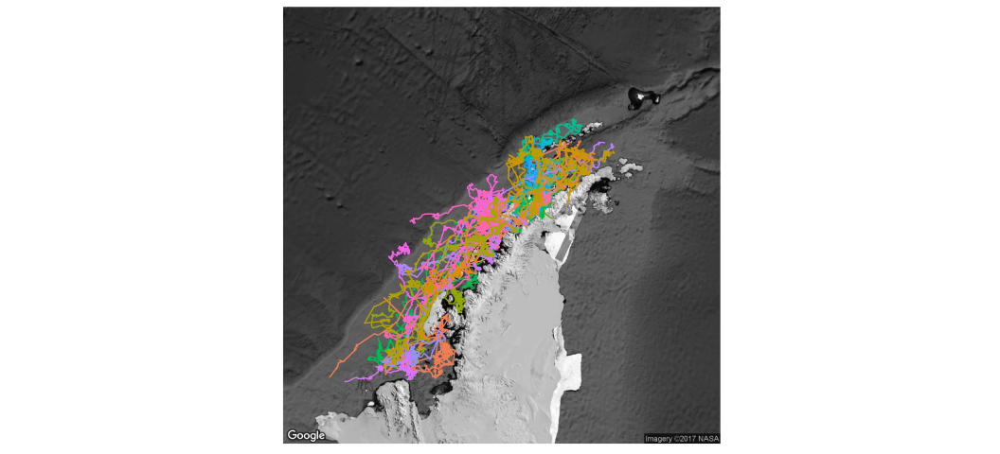
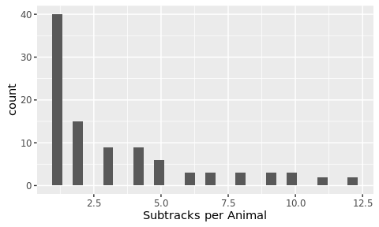
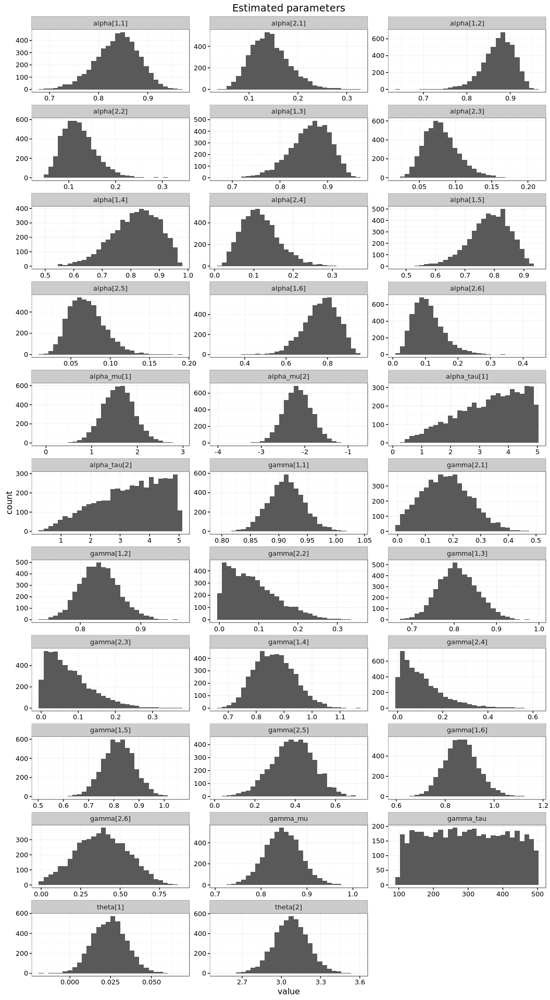
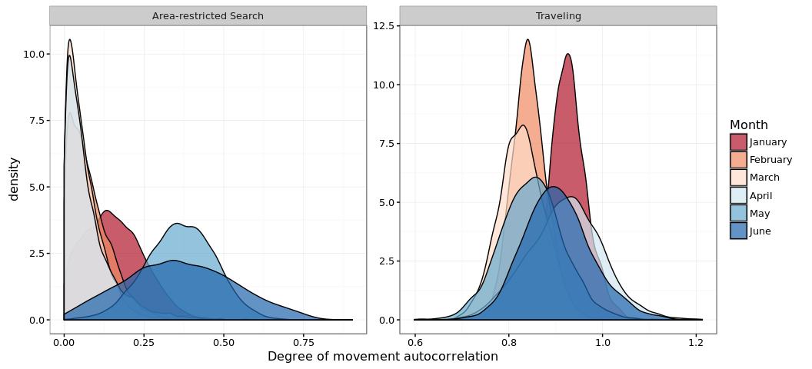

# Dynamic Foraging Patterns in Antarctic Humpbacks
Ben Weinstein  
`r Sys.time()`  


```
## Source: local data frame [2 x 2]
## 
##   Animal max(timestamp, na.rm = T)
##    (int)                    (time)
## 1 123232       2013-09-28 07:28:00
## 2 123236       2013-03-18 11:26:00
```

<!-- -->

##By Month

<!-- --><!-- -->

#Correlated random walk

*Process Model*

$$ d_{t} \sim T*d_{t-1} + Normal(0,\Sigma)$$
$$ x_t = x_{t-1} + d_{t} $$

## Parameters

For each individual:

$$\theta = \text{Mean turning angle}$$
$$\gamma = \text{Move persistence} $$

For both behaviors process variance is:
$$ \sigma_{latitude} = 0.1$$
$$ \sigma_{longitude} = 0.1$$

##Behavioral States

$$ \text{For each individual i}$$
$$ Behavior_1 = \text{traveling}$$
$$ Behavior_2 = \text{foraging}$$

$$ \alpha_{i,1,1} = \text{Probability of remaining traveling when traveling}$$
$$\alpha_{i,2,1} = \text{Probability of switching from Foraging to traveling}$$

$$\begin{matrix}
  \alpha_{i,1,1} & 1-\alpha_{i,1,1} \\
  \alpha_{i,2,1} & 1-\alpha_{i,2,1} \\
\end{matrix}$$

With the probability of switching states:

$$logit(\phi_{traveling}) = \alpha_{Behavior_{t-1}}$$

$$\phi_{foraging} = 1 - \phi_{traveling} $$

##Continious tracks

The transmitter will often go dark for 10 to 12 hours, due to weather, right in the middle of an otherwise good track. The model requires regular intervals to estimate the turning angles and temporal autocorrelation. As a track hits one of these walls, call it the end of a track, and begin a new track once the weather improves. We can remove any micro-tracks that are less than three days.
Specify a duration, calculate the number of tracks and the number of removed points. Iteratively.


### After filitering

<!-- -->


How did the filter change the extent of tracks?

<!-- -->

<!-- -->

<!-- --><!-- -->


sink("Bayesian/Multi_RW.jags")
cat("
    model{
    
    #Constants
    pi <- 3.141592653589
    
    #for each if 6 argos class observation error
    
    for(x in 1:6){
    
    ##argos observation error##
    argos_prec[x,1:2,1:2] <- argos_cov[x,,]
    
    #Constructing the covariance matrix
    argos_cov[x,1,1] <- argos_sigma[x]
    argos_cov[x,1,2] <- 0
    argos_cov[x,2,1] <- 0
    argos_cov[x,2,2] <- argos_alpha[x]
    }
    
    for(i in 1:ind){
    for(g in 1:tracks[i]){
    
    ## Priors for first true location
    #for lat long
    y[i,g,1,1:2] ~ dmnorm(argos[i,g,1,1,1:2],argos_prec[1,1:2,1:2])
    
    #First movement - random walk.
    y[i,g,2,1:2] ~ dmnorm(y[i,g,1,1:2],iSigma)
    
    ###First Behavioral State###
    state[i,g,1] ~ dcat(lambda[]) ## assign state for first obs
    
    #Process Model for movement
    for(t in 2:(steps[i,g]-1)){
    
    #Behavioral State at time T
    phi[i,g,t,1] <- alpha[state[i,g,t-1],Month[i,g,t]] 
    phi[i,g,t,2] <- 1-phi[i,g,t,1]
    state[i,g,t] ~ dcat(phi[i,g,t,])
    
    #Turning covariate
    #Transition Matrix for turning angles
    T[i,g,t,1,1] <- cos(theta[state[i,g,t]])
    T[i,g,t,1,2] <- (-sin(theta[state[i,g,t]]))
    T[i,g,t,2,1] <- sin(theta[state[i,g,t]])
    T[i,g,t,2,2] <- cos(theta[state[i,g,t]])
    
    #Correlation in movement change
    d[i,g,t,1:2] <- y[i,g,t,] + gamma[state[i,g,t],Month[i,g,t]] * T[i,g,t,,] %*% (y[i,g,t,1:2] - y[i,g,t-1,1:2])
    
    #Gaussian Displacement
    y[i,g,t+1,1:2] ~ dmnorm(d[i,g,t,1:2],iSigma)
    }
    
    #Final behavior state
    phi[i,g,steps[i,g],1] <- alpha[state[i,g,steps[i,g]-1],Month[i,g,steps[i,g]-1]] 
    phi[i,g,steps[i,g],2] <- 1-phi[i,g,steps[i,g],1]
    state[i,g,steps[i,g]] ~ dcat(phi[i,g,steps[i,g],])
    
    ##	Measurement equation - irregular observations
    # loops over regular time intervals (t)    
    
    for(t in 2:steps[i,g]){
    
    # loops over observed locations within interval t
    for(u in 1:idx[i,g,t]){ 
    zhat[i,g,t,u,1:2] <- (1-j[i,g,t,u]) * y[i,g,t-1,1:2] + j[i,g,t,u] * y[i,g,t,1:2]
    
    #for each lat and long
    #argos error
    argos[i,g,t,u,1:2] ~ dmnorm(zhat[i,g,t,u,1:2],argos_prec[argos_class[i,g,t,u],1:2,1:2])
    }
    }
    }
    }
    ###Priors###
    
    #Process Variance
    iSigma ~ dwish(R,2)
    Sigma <- inverse(iSigma)
    
    ##Mean Angle
    tmp[1] ~ dbeta(10, 10)
    tmp[2] ~ dbeta(10, 10)
    
    # prior for theta in 'traveling state'
    theta[1] <- (2 * tmp[1] - 1) * pi
    
    # prior for theta in 'foraging state'    
    theta[2] <- (tmp[2] * pi * 2)
    
    ##Move persistance
    # prior for gamma (autocorrelation parameter) in state 1

    #for each month
    for (m in 1:Months){

      #Intercepts
      logit(alpha[1,m]) <- alpha_mu_invlogit[1,m]
      alpha_mu_invlogit[1,m] ~ dnorm(alpha_mu[1],alpha_tau[1])
      
      logit(alpha[2,m]) <- alpha_mu_invlogit[2,m]
      alpha_mu_invlogit[2,m] ~ dnorm(alpha_mu[2],alpha_tau[2])
      
      gamma[1,m] ~ dbeta(3,2)		## gamma for state 1
      dev[m] ~ dbeta(1,1)			## a random deviate to ensure that gamma[1] > gamma[2]
      gamma[2,m] <- gamma[1,m] * dev[m]
    }
    
    ##Behavioral States
    
    #Hierarchical structure across months
    
    #Switching among states in inv.logit space
    alpha_mu[1] ~ dnorm(0,0.386)
    alpha_mu[2] ~ dnorm(0,0.386)

    #Variance in state change per month
    alpha_tau[1] ~ dgamma(0.0001,0.0001)
    alpha_tau[2] ~ dgamma(0.0001,0.0001)
    
    #Probability of behavior switching 
    lambda[1] ~ dbeta(1,1)
    lambda[2] <- 1 - lambda[1]
    
    ##Argos priors##
    #longitudinal argos precision, from Jonsen 2005, 2016, represented as precision not sd
    
    #by argos class
    argos_sigma[1] <- 11.9016
    argos_sigma[2] <- 10.2775
    argos_sigma[3] <- 1.228984
    argos_sigma[4] <- 2.162593
    argos_sigma[5] <- 3.885832
    argos_sigma[6] <- 0.0565539
    
    #latitidunal argos precision, from Jonsen 2005, 2016
    argos_alpha[1] <- 67.12537
    argos_alpha[2] <- 14.73474
    argos_alpha[3] <- 4.718973
    argos_alpha[4] <- 0.3872023
    argos_alpha[5] <- 3.836444
    argos_alpha[6] <- 0.1081156
    
    
    }"
    ,fill=TRUE)
sink()


```
##      user    system   elapsed 
##     4.577     0.608 10677.556
```


##Chains

```
##            used  (Mb) gc trigger   (Mb)  max used   (Mb)
## Ncells  1316965  70.4    2637877  140.9   2637877  140.9
## Vcells 67221447 512.9  154967408 1182.4 142613440 1088.1
```

```
##            used  (Mb) gc trigger  (Mb)  max used   (Mb)
## Ncells  1309557  70.0    2637877 140.9   2637877  140.9
## Vcells 23009580 175.6  123973926 945.9 142613440 1088.1
```

<!-- --><!-- -->


<!-- -->

## Change in autocorrelation over time

<!-- --><!-- -->

# Change in transition probabilities over time

<!-- --><!-- -->

## Parameter Summary


```
##    parameter          par          mean       lower        upper
## 1      alpha   alpha[1,1]    0.86889058  0.70736008    0.9599329
## 2      alpha   alpha[2,1]    0.07749341  0.02926343    0.1607627
## 3      alpha   alpha[1,2]    0.89731036  0.81892518    0.9629942
## 4      alpha   alpha[2,2]    0.07080047  0.02942902    0.1324746
## 5      alpha   alpha[1,3]    0.87551786  0.74335947    0.9595886
## 6      alpha   alpha[2,3]    0.06220564  0.02080083    0.1173844
## 7      alpha   alpha[1,4]    0.83635962  0.48025207    0.9593019
## 8      alpha   alpha[2,4]    0.07515583  0.02464966    0.1581212
## 9   alpha_mu  alpha_mu[1]    1.99076996  0.82174095    2.9685912
## 10  alpha_mu  alpha_mu[2]   -2.62749126 -3.42910697   -1.7245048
## 11 alpha_tau alpha_tau[1]  956.22087995  0.22199589 5501.2365980
## 12 alpha_tau alpha_tau[2] 1067.43994161  0.48344033 5700.4313655
## 13     gamma   gamma[1,1]    0.52928441  0.25709448    0.7981171
## 14     gamma   gamma[2,1]    0.23499121  0.02237729    0.5128794
## 15     gamma   gamma[1,2]    0.72591753  0.59979522    0.8489317
## 16     gamma   gamma[2,2]    0.19800407  0.01407748    0.4848036
## 17     gamma   gamma[1,3]    0.61199329  0.41289264    0.8235036
## 18     gamma   gamma[2,3]    0.29428258  0.06754258    0.5242353
## 19     gamma   gamma[1,4]    0.45170657  0.17063885    0.7845834
## 20     gamma   gamma[2,4]    0.18017117  0.01547798    0.4316955
## 21     theta     theta[1]    0.06636237 -0.03920256    0.1762299
## 22     theta     theta[2]    3.21355391  2.69634661    3.7480006
```

<!-- -->

#Behavioral Prediction


<!-- -->

##Spatial Prediction

<!-- --><!-- --><!-- -->

## By individual

<!-- -->

##Autocorrelation in behavior

<!-- -->

### As single timeline

<!-- -->

#Simulated tracks

<!-- -->

##Behavioral description

###Proportion of states by month

<!-- --><!-- -->

###Distance between bouts

<!-- --><!-- -->

#Behavior duration


```
## Source: local data frame [12 x 7]
## Groups: Animal, Track, Bout, phistate [12]
## 
##    Animal Track  Bout  phistate MonthF       Days    Month
##     (dbl) (dbl) (int)    (fctr)  (dbl)      (dbl)   (fctr)
## 1       1     1     2 Traveling      2  1.3513889 February
## 2       1     1     4 Traveling      3  2.4715278    March
## 3       1     1     6 Traveling      4  1.4750000    April
## 4       2     1     1 Traveling      2  6.3402778 February
## 5       2     1     3 Traveling      2  2.8000000 February
## 6       2     1     5 Traveling      2 17.9652778 February
## 7       3     1     2 Traveling      1  0.9509375  January
## 8       3     1     4 Traveling      1  2.7434028  January
## 9       3     1     6 Traveling      2  2.4634375 February
## 10      4     1     2 Traveling      1  4.4351968  January
## 11      4     1     4 Traveling      1  5.9662500  January
## 12      4     1     6 Traveling      2 11.4628819 February
```

```
## Source: local data frame [19 x 7]
## Groups: Animal, Track, Bout, phistate [19]
## 
##    Animal Track  Bout               phistate MonthF       Days    Month
##     (dbl) (dbl) (int)                 (fctr)  (dbl)      (dbl)   (fctr)
## 1       1     1     1 Area-restricted Search      2  8.8687500 February
## 2       1     1     3 Area-restricted Search      2 29.7638889 February
## 3       1     1     5 Area-restricted Search      3 22.4395833    March
## 4       1     1     7 Area-restricted Search      4  8.8083333    April
## 5       2     1     2 Area-restricted Search      2  4.8215278 February
## 6       2     1     4 Area-restricted Search      2  1.8284722 February
## 7       2     1     6 Area-restricted Search      3  3.4305556    March
## 8       3     1     1 Area-restricted Search      1  9.9591435  January
## 9       3     1     3 Area-restricted Search      1  6.4850694  January
## 10      3     1     5 Area-restricted Search      2 10.9568750 February
## 11      3     1     7 Area-restricted Search      2  2.3541204 February
## 12      4     1     1 Area-restricted Search      1  5.9826852  January
## 13      4     1     3 Area-restricted Search      1  2.9365278  January
## 14      4     1     5 Area-restricted Search      1  9.9229398  January
## 15      4     1     7 Area-restricted Search      2  5.0989120 February
## 16      4     2     1 Area-restricted Search      2 18.9131829 February
## 17      4     3     1 Area-restricted Search      3  0.6460301    March
## 18      4     4     1 Area-restricted Search      3  1.3696991    March
## 19      4     5     1 Area-restricted Search      3  1.0939931    March
```

```
## Source: local data frame [31 x 7]
## Groups: Animal, Track, Bout, phistate [31]
## 
##    Animal Track  Bout               phistate MonthF      Days    Month
##     (dbl) (dbl) (int)                 (fctr)  (dbl)     (dbl)   (fctr)
## 1       1     1     1 Area-restricted Search      2  8.868750 February
## 2       1     1     2              Traveling      2  1.351389 February
## 3       1     1     3 Area-restricted Search      2 29.763889 February
## 4       1     1     4              Traveling      3  2.471528    March
## 5       1     1     5 Area-restricted Search      3 22.439583    March
## 6       1     1     6              Traveling      4  1.475000    April
## 7       1     1     7 Area-restricted Search      4  8.808333    April
## 8       2     1     1              Traveling      2  6.340278 February
## 9       2     1     2 Area-restricted Search      2  4.821528 February
## 10      2     1     3              Traveling      2  2.800000 February
## ..    ...   ...   ...                    ...    ...       ...      ...
```

<!-- -->

##Proportion of time allocation
<!-- -->

```
##      Month Traveling Area-restricted Search     PropF TotalTime
## 1  January 14.095787              35.286366 0.7145571  49.38215
## 2 February 42.383264              82.605729 0.6609040 124.98899
## 3    March  2.471528              28.979861 0.9214175  31.45139
## 4    April  1.475000               8.808333 0.8565640  10.28333
```

## Number of bouts

<!-- -->

#Time spent in grid cell
## All years
<!-- --><!-- --><!-- -->

##Add in sea ice

<!-- -->


