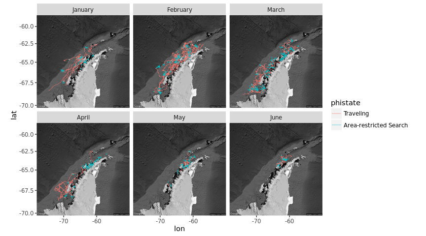

# Dynamic Foraging Patterns in Antarctic Humpbacks
Ben Weinstein  
`r Sys.time()`  


```
## Source: local data frame [12 x 2]
## 
##    Animal max(timestamp, na.rm = T)
##     (int)                    (time)
## 1  112699       2012-06-17 03:57:31
## 2  121207       2013-05-09 18:49:00
## 3  121208       2013-02-18 07:52:00
## 4  121210       2013-05-05 07:44:00
## 5  123224       2013-05-24 12:13:00
## 6  123232       2013-09-28 07:28:00
## 7  123236       2013-03-18 11:26:00
## 8  131127       2016-07-15 07:58:36
## 9  131130       2016-04-30 00:30:06
## 10 131132       2016-05-10 19:44:39
## 11 131133       2016-07-05 20:26:44
## 12 131136       2016-06-30 18:49:35
```

<!-- -->

##By Month

<!-- --><!-- -->

#Correlated random walk

*Process Model*

$$ d_{t} \sim T*d_{t-1} + Normal(0,\Sigma)$$
$$ x_t = x_{t-1} + d_{t} $$

## Parameters

For each individual:

$$\theta = \text{Mean turning angle}$$
$$\gamma = \text{Move persistence} $$

For both behaviors process variance is:
$$ \sigma_{latitude} = 0.1$$
$$ \sigma_{longitude} = 0.1$$

##Behavioral States

$$ \text{For each individual i}$$
$$ Behavior_1 = \text{traveling}$$
$$ Behavior_2 = \text{foraging}$$

$$ \alpha_{i,1,1} = \text{Probability of remaining traveling when traveling}$$
$$\alpha_{i,2,1} = \text{Probability of switching from Foraging to traveling}$$

$$\begin{matrix}
  \alpha_{i,1,1} & 1-\alpha_{i,1,1} \\
  \alpha_{i,2,1} & 1-\alpha_{i,2,1} \\
\end{matrix}$$

With the probability of switching states:

$$logit(\phi_{traveling}) = \alpha_{Behavior_{t-1}}$$

$$\phi_{foraging} = 1 - \phi_{traveling} $$

##Continious tracks

The transmitter will often go dark for 10 to 12 hours, due to weather, right in the middle of an otherwise good track. The model requires regular intervals to estimate the turning angles and temporal autocorrelation. As a track hits one of these walls, call it the end of a track, and begin a new track once the weather improves. We can remove any micro-tracks that are less than three days.
Specify a duration, calculate the number of tracks and the number of removed points. Iteratively.


### After filitering

<!-- -->


How did the filter change the extent of tracks?

<!-- -->

<!-- -->

<!-- --><!-- -->


sink("Bayesian/Multi_RW.jags")
cat("
    model{
    
    #Constants
    pi <- 3.141592653589
    
    #for each if 6 argos class observation error
    
    for(x in 1:6){
    
    ##argos observation error##
    argos_prec[x,1:2,1:2] <- argos_cov[x,,]
    
    #Constructing the covariance matrix
    argos_cov[x,1,1] <- argos_sigma[x]
    argos_cov[x,1,2] <- 0
    argos_cov[x,2,1] <- 0
    argos_cov[x,2,2] <- argos_alpha[x]
    }
    
    for(i in 1:ind){
    for(g in 1:tracks[i]){
    
    ## Priors for first true location
    #for lat long
    y[i,g,1,1:2] ~ dmnorm(argos[i,g,1,1,1:2],argos_prec[1,1:2,1:2])
    
    #First movement - random walk.
    y[i,g,2,1:2] ~ dmnorm(y[i,g,1,1:2],iSigma)
    
    ###First Behavioral State###
    state[i,g,1] ~ dcat(lambda[]) ## assign state for first obs
    
    #Process Model for movement
    for(t in 2:(steps[i,g]-1)){
    
    #Behavioral State at time T
    phi[i,g,t,1] <- alpha[state[i,g,t-1],Month[i,g,t]] 
    phi[i,g,t,2] <- 1-phi[i,g,t,1]
    state[i,g,t] ~ dcat(phi[i,g,t,])
    
    #Turning covariate
    #Transition Matrix for turning angles
    T[i,g,t,1,1] <- cos(theta[state[i,g,t]])
    T[i,g,t,1,2] <- (-sin(theta[state[i,g,t]]))
    T[i,g,t,2,1] <- sin(theta[state[i,g,t]])
    T[i,g,t,2,2] <- cos(theta[state[i,g,t]])
    
    #Correlation in movement change
    d[i,g,t,1:2] <- y[i,g,t,] + gamma[state[i,g,t],Month[i,g,t]] * T[i,g,t,,] %*% (y[i,g,t,1:2] - y[i,g,t-1,1:2])
    
    #Gaussian Displacement
    y[i,g,t+1,1:2] ~ dmnorm(d[i,g,t,1:2],iSigma)
    }
    
    #Final behavior state
    phi[i,g,steps[i,g],1] <- alpha[state[i,g,steps[i,g]-1],Month[i,g,steps[i,g]-1]] 
    phi[i,g,steps[i,g],2] <- 1-phi[i,g,steps[i,g],1]
    state[i,g,steps[i,g]] ~ dcat(phi[i,g,steps[i,g],])
    
    ##	Measurement equation - irregular observations
    # loops over regular time intervals (t)    
    
    for(t in 2:steps[i,g]){
    
    # loops over observed locations within interval t
    for(u in 1:idx[i,g,t]){ 
    zhat[i,g,t,u,1:2] <- (1-j[i,g,t,u]) * y[i,g,t-1,1:2] + j[i,g,t,u] * y[i,g,t,1:2]
    
    #for each lat and long
    #argos error
    argos[i,g,t,u,1:2] ~ dmnorm(zhat[i,g,t,u,1:2],argos_prec[argos_class[i,g,t,u],1:2,1:2])
    }
    }
    }
    }
    ###Priors###
    
    #Process Variance
    iSigma ~ dwish(R,2)
    Sigma <- inverse(iSigma)
    
    ##Mean Angle
    tmp[1] ~ dbeta(10, 10)
    tmp[2] ~ dbeta(10, 10)
    
    # prior for theta in 'traveling state'
    theta[1] <- (2 * tmp[1] - 1) * pi
    
    # prior for theta in 'foraging state'    
    theta[2] <- (tmp[2] * pi * 2)
    
    ##Move persistance
    # prior for gamma (autocorrelation parameter) in state 1

    #for each month
    for (m in 1:Months){

      #Intercepts
      logit(alpha[1,m]) <- alpha_mu_invlogit[1,m]
      alpha_mu_invlogit[1,m] ~ dnorm(alpha_mu[1],alpha_tau[1])
      
      logit(alpha[2,m]) <- alpha_mu_invlogit[2,m]
      alpha_mu_invlogit[2,m] ~ dnorm(alpha_mu[2],alpha_tau[2])
      
      gamma[1,m] ~ dnorm(gamma_mu,gamma_tau)		## gamma for state 1
      dev[m] ~ dbeta(1,1)			## a random deviate to ensure that gamma[1] > gamma[2]
      gamma[2,m] <- gamma[1,m] * dev[m]
    }
    
    ##Behavioral States
    
    #Hierarchical structure across months
    
    #Switching among states in inv.logit space
    alpha_mu[1] ~ dnorm(0,0.386)
    alpha_mu[2] ~ dnorm(0,0.386)

    #Variance in state change per month
    alpha_tau[1] ~ dunif(0,5)
    alpha_tau[2] ~ dunif(0,5)
    
    #Probability of behavior switching 
    lambda[1] ~ dbeta(1,1)
    lambda[2] <- 1 - lambda[1]

    #spatial autocorrelation priors, we know the true state is high autocorrelation
    gamma_mu~dnorm(0.8,100)

    #reasonable variance keeps the chains from wandering.
    gamma_tau ~ dunif(100,500)
    
    ##Argos priors##
    #longitudinal argos precision, from Jonsen 2005, 2016, represented as precision not sd
    
    #by argos class
    argos_sigma[1] <- 11.9016
    argos_sigma[2] <- 10.2775
    argos_sigma[3] <- 1.228984
    argos_sigma[4] <- 2.162593
    argos_sigma[5] <- 3.885832
    argos_sigma[6] <- 0.0565539
    
    #latitidunal argos precision, from Jonsen 2005, 2016
    argos_alpha[1] <- 67.12537
    argos_alpha[2] <- 14.73474
    argos_alpha[3] <- 4.718973
    argos_alpha[4] <- 0.3872023
    argos_alpha[5] <- 3.836444
    argos_alpha[6] <- 0.1081156
    
    
    }"
    ,fill=TRUE)
sink()


```
##       user     system    elapsed 
##    316.720      7.581 124584.851
```


##Chains

```
##             used   (Mb) gc trigger    (Mb)   max used    (Mb)
## Ncells   1490299   79.6    3205452   171.2    3205452   171.2
## Vcells 739201394 5639.7 1679167163 12811.1 1438345085 10973.8
```

```
##            used  (Mb) gc trigger    (Mb)   max used    (Mb)
## Ncells  1330370  71.1    3205452   171.2    3205452   171.2
## Vcells 73446613 560.4 1343333730 10248.9 1438345085 10973.8
```

<!-- --><!-- -->


<!-- -->

## Change in autocorrelation over time

<!-- --><!-- -->

# Change in transition probabilities over time

<!-- --><!-- -->

## Parameter Summary


```
##    parameter          par         mean         lower        upper
## 1      alpha   alpha[1,1]   0.82985183   0.757276168   0.89494832
## 2      alpha   alpha[2,1]   0.14870634   0.088521962   0.22125110
## 3      alpha   alpha[1,2]   0.87234851   0.806092500   0.93350723
## 4      alpha   alpha[2,2]   0.12547703   0.069816201   0.19209975
## 5      alpha   alpha[1,3]   0.86134201   0.790019193   0.92559452
## 6      alpha   alpha[2,3]   0.08341207   0.045995641   0.12362528
## 7      alpha   alpha[1,4]   0.82101250   0.673145389   0.93086268
## 8      alpha   alpha[2,4]   0.11827340   0.051983898   0.21239208
## 9      alpha   alpha[1,5]   0.78254551   0.655569001   0.88971177
## 10     alpha   alpha[2,5]   0.07210024   0.037075782   0.11830773
## 11     alpha   alpha[1,6]   0.76955497   0.619808124   0.88967533
## 12     alpha   alpha[2,6]   0.11071368   0.046928260   0.19887422
## 13  alpha_mu  alpha_mu[1]   1.57654645   1.046605996   2.17108201
## 14  alpha_mu  alpha_mu[2]  -2.12426098  -2.661344264  -1.58575105
## 15 alpha_tau alpha_tau[1]   3.35741130   1.303858375   4.88609145
## 16 alpha_tau alpha_tau[2]   3.30996426   1.301489406   4.88603178
## 17     gamma   gamma[1,1]   0.91533035   0.864729729   0.96749980
## 18     gamma   gamma[2,1]   0.17646786   0.038511418   0.32275673
## 19     gamma   gamma[1,2]   0.82954973   0.775843564   0.88459227
## 20     gamma   gamma[2,2]   0.08951457   0.006189414   0.21818810
## 21     gamma   gamma[1,3]   0.80724553   0.733755917   0.88201749
## 22     gamma   gamma[2,3]   0.08300320   0.005826999   0.21469995
## 23     gamma   gamma[1,4]   0.86088381   0.755799767   0.98791016
## 24     gamma   gamma[2,4]   0.12959253   0.008392384   0.35007613
## 25     gamma   gamma[1,5]   0.81883591   0.721104567   0.91825853
## 26     gamma   gamma[2,5]   0.38616397   0.215901987   0.54658313
## 27     gamma   gamma[1,6]   0.86107821   0.752434303   0.97947881
## 28     gamma   gamma[2,6]   0.39524535   0.114662059   0.67628137
## 29  gamma_mu     gamma_mu   0.84635848   0.782682984   0.90992783
## 30 gamma_tau    gamma_tau 300.62122733 122.629365266 477.54624052
## 31     theta     theta[1]   0.02566601   0.008396155   0.04298138
## 32     theta     theta[2]   3.08670289   2.873875730   3.30701563
```

<!-- -->

#Behavioral Prediction


<!-- -->

##Spatial Prediction

<!-- --><!-- --><!-- -->

## By individual

<!-- -->

##Autocorrelation in behavior

<!-- -->

### As single timeline

<!-- -->

#Simulated tracks

<!-- -->

##Behavioral description

###Proportion of states by month

<!-- --><!-- -->

###Distance between bouts

<!-- --><!-- -->

#Behavior duration


```
## Source: local data frame [169 x 7]
## Groups: Animal, Track, Bout, phistate [169]
## 
##    Animal Track  Bout  phistate MonthF      Days    Month
##     (dbl) (dbl) (int)    (fctr)  (dbl)     (dbl)   (fctr)
## 1       1     1     1 Traveling      1 0.1170949  January
## 2       1     2     1 Traveling      1 0.4953819  January
## 3       1     3     1 Traveling      1 0.6483912  January
## 4       1     4     1 Traveling      1 1.5586921  January
## 5       1     5     1 Traveling      1 0.6500116  January
## 6       1     7     1 Traveling      2 0.9866435 February
## 7       1     8     1 Traveling      2 0.5460301 February
## 8       1    10     1 Traveling      2 0.9215972 February
## 9       1    11     1 Traveling      2 2.6218171 February
## 10      1    12     1 Traveling      2 0.6120602 February
## ..    ...   ...   ...       ...    ...       ...      ...
```

```
## Source: local data frame [181 x 7]
## Groups: Animal, Track, Bout, phistate [181]
## 
##    Animal Track  Bout               phistate MonthF       Days    Month
##     (dbl) (dbl) (int)                 (fctr)  (dbl)      (dbl)   (fctr)
## 1       1     1     2 Area-restricted Search      1  0.1399769  January
## 2       1     6     1 Area-restricted Search      1  2.6031250  January
## 3       1     9     1 Area-restricted Search      2  3.3496065 February
## 4       2     1     2 Area-restricted Search      2  0.1554977 February
## 5       2     2     2 Area-restricted Search      3  0.1447917    March
## 6       2     2     4 Area-restricted Search      3 11.1066551    March
## 7       2     2     6 Area-restricted Search      3  0.9433218    March
## 8       2     2     8 Area-restricted Search      4  1.9837269    April
## 9       2     2    10 Area-restricted Search      4  3.9760880    April
## 10      2     2    12 Area-restricted Search      4  0.1050231    April
## ..    ...   ...   ...                    ...    ...        ...      ...
```

```
## Source: local data frame [350 x 7]
## Groups: Animal, Track, Bout, phistate [350]
## 
##    Animal Track  Bout               phistate MonthF      Days    Month
##     (dbl) (dbl) (int)                 (fctr)  (dbl)     (dbl)   (fctr)
## 1       1     1     1              Traveling      1 0.1170949  January
## 2       1     1     2 Area-restricted Search      1 0.1399769  January
## 3       1     2     1              Traveling      1 0.4953819  January
## 4       1     3     1              Traveling      1 0.6483912  January
## 5       1     4     1              Traveling      1 1.5586921  January
## 6       1     5     1              Traveling      1 0.6500116  January
## 7       1     6     1 Area-restricted Search      1 2.6031250  January
## 8       1     7     1              Traveling      2 0.9866435 February
## 9       1     8     1              Traveling      2 0.5460301 February
## 10      1     9     1 Area-restricted Search      2 3.3496065 February
## ..    ...   ...   ...                    ...    ...       ...      ...
```

<!-- -->

##Proportion of time allocation
<!-- -->

```
##      Month Traveling Area-restricted Search     PropF TotalTime
## 1  January 121.63677              140.97767 0.5368238 262.61444
## 2 February 213.52203              351.44615 0.6220636 564.96817
## 3    March 122.74743              205.16181 0.6256664 327.90924
## 4    April  47.94513              154.80477 0.7635258 202.74990
## 5      May  24.35963               82.92464 0.7729431 107.28427
## 6     June  16.04763               44.74221 0.7360146  60.78984
```

## Number of bouts

<!-- -->

#Time spent in grid cell
## All years
<!-- --><!-- --><!-- -->

##Add in sea ice

<!-- -->


