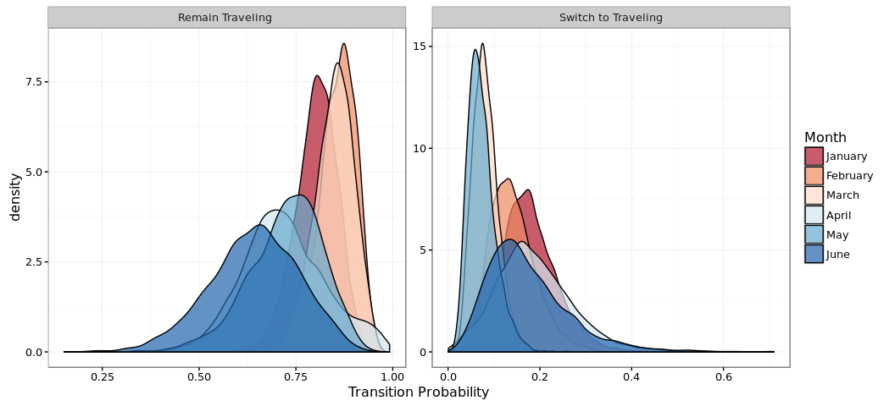
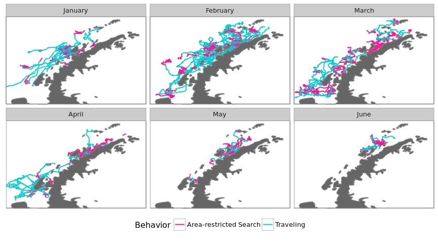

# Dynamic Foraging Patterns in Antarctic Humpbacks
Ben Weinstein  
`r Sys.time()`  


```
## Source: local data frame [12 x 2]
## 
##    Animal max(timestamp, na.rm = T)
##     (int)                    (time)
## 1  112699       2012-06-17 03:57:31
## 2  121207       2013-05-09 18:49:37
## 3  121208       2013-02-18 07:52:02
## 4  121210       2013-05-05 07:44:41
## 5  123224       2013-05-24 12:13:18
## 6  123232       2013-09-28 07:28:23
## 7  123236       2013-03-18 11:26:09
## 8  131127       2016-07-15 00:58:36
## 9  131130       2016-04-29 17:30:06
## 10 131132       2016-05-10 12:44:39
## 11 131133       2016-07-05 10:55:56
## 12 131136       2016-06-30 10:57:06
```

<!-- -->

##By Month

<!-- --><!-- -->

#Correlated random walk

*Process Model*

$$ d_{t} \sim T*d_{t-1} + Normal(0,\Sigma)$$
$$ x_t = x_{t-1} + d_{t} $$

## Parameters

For each individual:

$$\theta = \text{Mean turning angle}$$
$$\gamma = \text{Move persistence} $$

For both behaviors process variance is:
$$ \sigma_{latitude} = 0.1$$
$$ \sigma_{longitude} = 0.1$$

##Behavioral States

$$ \text{For each individual i}$$
$$ Behavior_1 = \text{traveling}$$
$$ Behavior_2 = \text{foraging}$$

$$ \alpha_{i,1,1} = \text{Probability of remaining traveling when traveling}$$
$$\alpha_{i,2,1} = \text{Probability of switching from Foraging to traveling}$$

$$\begin{matrix}
  \alpha_{i,1,1} & 1-\alpha_{i,1,1} \\
  \alpha_{i,2,1} & 1-\alpha_{i,2,1} \\
\end{matrix}$$

With the probability of switching states:

$$logit(\phi_{traveling}) = \alpha_{Behavior_{t-1}}$$

$$\phi_{foraging} = 1 - \phi_{traveling} $$

##Continious tracks

The transmitter will often go dark for 10 to 12 hours, due to weather, right in the middle of an otherwise good track. The model requires regular intervals to estimate the turning angles and temporal autocorrelation. As a track hits one of these walls, call it the end of a track, and begin a new track once the weather improves. We can remove any micro-tracks that are less than three days.
Specify a duration, calculate the number of tracks and the number of removed points. Iteratively.


### After filitering

<!-- -->


How did the filter change the extent of tracks?

<!-- -->

<!-- -->

<!-- --><!-- -->


sink("Bayesian/Multi_RW.jags")
cat("
    model{
    
    #Constants
    pi <- 3.141592653589
    
    #for each if 6 argos class observation error
    
    for(x in 1:6){
    
    ##argos observation error##
    argos_prec[x,1:2,1:2] <- argos_cov[x,,]
    
    #Constructing the covariance matrix
    argos_cov[x,1,1] <- argos_sigma[x]
    argos_cov[x,1,2] <- 0
    argos_cov[x,2,1] <- 0
    argos_cov[x,2,2] <- argos_alpha[x]
    }
    
    for(i in 1:ind){
    for(g in 1:tracks[i]){
    
    ## Priors for first true location
    #for lat long
    y[i,g,1,1:2] ~ dmnorm(argos[i,g,1,1,1:2],argos_prec[1,1:2,1:2])
    
    #First movement - random walk.
    y[i,g,2,1:2] ~ dmnorm(y[i,g,1,1:2],iSigma)
    
    ###First Behavioral State###
    state[i,g,1] ~ dcat(lambda[]) ## assign state for first obs
    
    #Process Model for movement
    for(t in 2:(steps[i,g]-1)){
    
    #Behavioral State at time T
    phi[i,g,t,1] <- alpha_mu[state[i,g,t-1],Month[i,g,t]] 
    phi[i,g,t,2] <- 1-phi[i,g,t,1]
    state[i,g,t] ~ dcat(phi[i,g,t,])
    
    #Turning covariate
    #Transition Matrix for turning angles
    T[i,g,t,1,1] <- cos(theta[state[i,g,t]])
    T[i,g,t,1,2] <- (-sin(theta[state[i,g,t]]))
    T[i,g,t,2,1] <- sin(theta[state[i,g,t]])
    T[i,g,t,2,2] <- cos(theta[state[i,g,t]])
    
    #Correlation in movement change
    d[i,g,t,1:2] <- y[i,g,t,] + gamma[state[i,g,t],Month[i,g,t]] * T[i,g,t,,] %*% (y[i,g,t,1:2] - y[i,g,t-1,1:2])
    
    #Gaussian Displacement
    y[i,g,t+1,1:2] ~ dmnorm(d[i,g,t,1:2],iSigma)
    }
    
    #Final behavior state
    phi[i,g,steps[i,g],1] <- alpha_mu[state[i,g,steps[i,g]-1],Month[i,g,steps[i,g]-1]] 
    phi[i,g,steps[i,g],2] <- 1-phi[i,g,steps[i,g],1]
    state[i,g,steps[i,g]] ~ dcat(phi[i,g,steps[i,g],])
    
    ##	Measurement equation - irregular observations
    # loops over regular time intervals (t)    
    
    for(t in 2:steps[i,g]){
    
    # loops over observed locations within interval t
    for(u in 1:idx[i,g,t]){ 
    zhat[i,g,t,u,1:2] <- (1-j[i,g,t,u]) * y[i,g,t-1,1:2] + j[i,g,t,u] * y[i,g,t,1:2]
    
    #for each lat and long
    #argos error
    argos[i,g,t,u,1:2] ~ dmnorm(zhat[i,g,t,u,1:2],argos_prec[argos_class[i,g,t,u],1:2,1:2])
    }
    }
    }
    }
    ###Priors###
    
    #Process Variance
    iSigma ~ dwish(R,2)
    Sigma <- inverse(iSigma)
    
    ##Mean Angle
    tmp[1] ~ dbeta(10, 10)
    tmp[2] ~ dbeta(10, 10)
    
    # prior for theta in 'traveling state'
    theta[1] <- (2 * tmp[1] - 1) * pi
    
    # prior for theta in 'foraging state'    
    theta[2] <- (tmp[2] * pi * 2)
    
    ##Move persistance
    # prior for gamma (autocorrelation parameter) in state 1

    #for each month
    for (m in 1:Months){

      #Intercepts
      alpha_mu[1,m] ~ dbeta(1,1)
      alpha_mu[2,m] ~ dbeta(1,1)
      
      gamma[1,m] ~ dbeta(3,2)		## gamma for state 1
      dev[m] ~ dbeta(1,1)			## a random deviate to ensure that gamma[1] > gamma[2]
      gamma[2,m] <- gamma[1,m] * dev[m]
    }
    
    ##Behavioral States
    
    #Hierarchical structure across motnhs
    
    #Variance
    alpha_tau[1] ~ dt(0,1,1)I(0,)
    alpha_tau[2] ~ dt(0,1,1)I(0,)
    
    #Probability of behavior switching 
    lambda[1] ~ dbeta(1,1)
    lambda[2] <- 1 - lambda[1]
    
    ##Argos priors##
    #longitudinal argos precision, from Jonsen 2005, 2016, represented as precision not sd
    
    #by argos class
    argos_sigma[1] <- 11.9016
    argos_sigma[2] <- 10.2775
    argos_sigma[3] <- 1.228984
    argos_sigma[4] <- 2.162593
    argos_sigma[5] <- 3.885832
    argos_sigma[6] <- 0.0565539
    
    #latitidunal argos precision, from Jonsen 2005, 2016
    argos_alpha[1] <- 67.12537
    argos_alpha[2] <- 14.73474
    argos_alpha[3] <- 4.718973
    argos_alpha[4] <- 0.3872023
    argos_alpha[5] <- 3.836444
    argos_alpha[6] <- 0.1081156
    
    
    }"
    ,fill=TRUE)
sink()


```
##      user    system   elapsed 
##   269.989     2.380 37110.573
```


##Chains

```
##             used   (Mb) gc trigger   (Mb)  max used   (Mb)
## Ncells   1486124   79.4    3886542  207.6   3886542  207.6
## Vcells 265483546 2025.5  537136906 4098.1 458856903 3500.9
```

```
##            used  (Mb) gc trigger   (Mb)  max used   (Mb)
## Ncells  1340845  71.7    3886542  207.6   3886542  207.6
## Vcells 43972458 335.5  429709524 3278.5 458856903 3500.9
```

<!-- --><!-- -->


<!-- -->

## Change in autocorrelation over time

<!-- --><!-- -->

# Change in transition probabilities over time

<!-- --><!-- -->

## Parameter Summary


```
##    parameter           par       mean       lower      upper
## 1   alpha_mu alpha_mu[1,1] 0.80939346 0.724762645 0.88613117
## 2   alpha_mu alpha_mu[2,1] 0.17571475 0.102955854 0.27153681
## 3   alpha_mu alpha_mu[1,2] 0.87632760 0.779557575 0.94156395
## 4   alpha_mu alpha_mu[2,2] 0.12880976 0.069129913 0.22523318
## 5   alpha_mu alpha_mu[1,3] 0.87926173 0.797097442 0.95165829
## 6   alpha_mu alpha_mu[2,3] 0.07275752 0.035190811 0.12449611
## 7   alpha_mu alpha_mu[1,4] 0.74446667 0.599963292 0.89971100
## 8   alpha_mu alpha_mu[2,4] 0.17960882 0.080108656 0.31319005
## 9   alpha_mu alpha_mu[1,5] 0.75987608 0.578890583 0.90243776
## 10  alpha_mu alpha_mu[2,5] 0.08120333 0.033314499 0.14775759
## 11     gamma    gamma[1,1] 0.92798009 0.877399400 0.97385910
## 12     gamma    gamma[2,1] 0.15202233 0.030398251 0.30095090
## 13     gamma    gamma[1,2] 0.82027378 0.758618330 0.89599102
## 14     gamma    gamma[2,2] 0.10001532 0.007260477 0.25272041
## 15     gamma    gamma[1,3] 0.77875245 0.695370754 0.86984580
## 16     gamma    gamma[2,3] 0.07527076 0.003282894 0.19242231
## 17     gamma    gamma[1,4] 0.88472363 0.760832949 0.97518770
## 18     gamma    gamma[2,4] 0.09182517 0.007940480 0.25261667
## 19     gamma    gamma[1,5] 0.72704760 0.571240546 0.88764601
## 20     gamma    gamma[2,5] 0.39217730 0.202489244 0.56002231
## 21     theta      theta[1] 0.02488821 0.007324217 0.04235485
## 22     theta      theta[2] 3.08718613 2.785248431 3.37649120
```

<!-- -->

#Behavioral Prediction


<!-- -->

##Spatial Prediction

<!-- --><!-- --><!-- -->

## By individual

<!-- -->

##Autocorrelation in behavior

<!-- -->

### As single timeline

<!-- -->

#Simulated tracks

<!-- -->

##Behavioral description

###Proportion of states by month

<!-- --><!-- -->

###Distance between bouts

<!-- --><!-- -->

#Behavior duration


```
## Source: local data frame [140 x 7]
## Groups: Animal, Track, Bout, phistate [140]
## 
##    Animal Track  Bout  phistate MonthF       Days    Month
##     (dbl) (dbl) (int)    (fctr)  (dbl)      (dbl)   (fctr)
## 1       1     2     1 Traveling      1  0.4781829  January
## 2       1     4     1 Traveling      1  1.5586921  January
## 3       1     5     1 Traveling      1  0.6500116  January
## 4       1     7     1 Traveling      2  0.9866435 February
## 5       1    10     1 Traveling      2  0.9215972 February
## 6       1    11     1 Traveling      2  2.6218171 February
## 7       2     1     1 Traveling      1 16.1553009  January
## 8       2     1     3 Traveling      2 14.1499421 February
## 9       2     2     1 Traveling      3  8.6612037    March
## 10      2     2     3 Traveling      3 12.9640741    March
## ..    ...   ...   ...       ...    ...        ...      ...
```

```
## Source: local data frame [172 x 7]
## Groups: Animal, Track, Bout, phistate [172]
## 
##    Animal Track  Bout               phistate MonthF       Days    Month
##     (dbl) (dbl) (int)                 (fctr)  (dbl)      (dbl)   (fctr)
## 1       1     1     1 Area-restricted Search      1  0.6059028  January
## 2       1     2     2 Area-restricted Search      1  0.0000000  January
## 3       1     3     1 Area-restricted Search      1  0.6483912  January
## 4       1     6     1 Area-restricted Search      1  2.6031250  January
## 5       1     8     1 Area-restricted Search      2  0.5460301 February
## 6       1     9     1 Area-restricted Search      2  3.3496065 February
## 7       1    12     1 Area-restricted Search      2  0.6120602 February
## 8       2     1     2 Area-restricted Search      2  0.1554977 February
## 9       2     2     2 Area-restricted Search      3 10.6119097    March
## 10      2     2     4 Area-restricted Search      4  2.4937847    April
## ..    ...   ...   ...                    ...    ...        ...      ...
```

```
## Source: local data frame [312 x 7]
## Groups: Animal, Track, Bout, phistate [312]
## 
##    Animal Track  Bout               phistate MonthF      Days    Month
##     (dbl) (dbl) (int)                 (fctr)  (dbl)     (dbl)   (fctr)
## 1       1     1     1 Area-restricted Search      1 0.6059028  January
## 2       1     2     1              Traveling      1 0.4781829  January
## 3       1     2     2 Area-restricted Search      1 0.0000000  January
## 4       1     3     1 Area-restricted Search      1 0.6483912  January
## 5       1     4     1              Traveling      1 1.5586921  January
## 6       1     5     1              Traveling      1 0.6500116  January
## 7       1     6     1 Area-restricted Search      1 2.6031250  January
## 8       1     7     1              Traveling      2 0.9866435 February
## 9       1     8     1 Area-restricted Search      2 0.5460301 February
## 10      1     9     1 Area-restricted Search      2 3.3496065 February
## ..    ...   ...   ...                    ...    ...       ...      ...
```

<!-- -->

##Proportion of time allocation
<!-- -->

```
##      Month Traveling Area-restricted Search     PropF TotalTime
## 1  January 124.81784              152.41347 0.5497701 277.23131
## 2 February 230.64413              338.60061 0.5948243 569.24475
## 3    March  98.93443              207.06300 0.6766821 305.99743
## 4    April  50.42377              163.84080 0.7646658 214.26457
## 5      May  22.92902               60.52991 0.7252659  83.45892
```

## Number of bouts

<!-- -->

#Time spent in grid cell
## All years
<!-- --><!-- --><!-- -->

##Add in sea ice

<!-- -->


