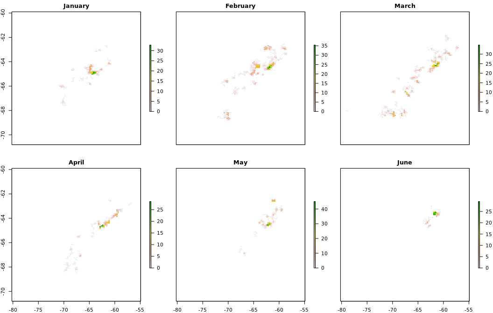

# Dynamic Foraging Patterns in Antarctic Humpbacks
Ben Weinstein  
`r Sys.time()`  


```
## # A tibble: 12 × 2
##    Animal `max(timestamp, na.rm = T)`
##     <int>                      <dttm>
## 1  112699         2012-06-17 03:57:31
## 2  121207         2013-05-09 18:49:37
## 3  121208         2013-02-18 07:52:02
## 4  121210         2013-05-05 07:44:41
## 5  123224         2013-05-24 12:13:18
## 6  123232         2013-09-28 07:28:23
## 7  123236         2013-03-18 11:26:09
## 8  131127         2016-07-15 00:58:36
## 9  131130         2016-04-29 17:30:06
## 10 131132         2016-05-10 12:44:39
## 11 131133         2016-07-05 10:55:56
## 12 131136         2016-06-30 10:57:06
```

<!-- -->

##By Month

<!-- --><!-- -->

#Correlated random walk

*Process Model*

$$ d_{t} \sim T*d_{t-1} + Normal(0,\Sigma)$$
$$ x_t = x_{t-1} + d_{t} $$

## Parameters

For each individual:

$$\theta = \text{Mean turning angle}$$
$$\gamma = \text{Move persistence} $$

For both behaviors process variance is:
$$ \sigma_{latitude} = 0.1$$
$$ \sigma_{longitude} = 0.1$$

##Behavioral States

$$ \text{For each individual i}$$
$$ Behavior_1 = \text{traveling}$$
$$ Behavior_2 = \text{foraging}$$

$$ \alpha_{i,1,1} = \text{Probability of remaining traveling when traveling}$$
$$\alpha_{i,2,1} = \text{Probability of switching from Foraging to traveling}$$

$$\begin{matrix}
  \alpha_{i,1,1} & 1-\alpha_{i,1,1} \\
  \alpha_{i,2,1} & 1-\alpha_{i,2,1} \\
\end{matrix}$$

With the probability of switching states:

$$logit(\phi_{traveling}) = \alpha_{Behavior_{t-1}}$$

$$\phi_{foraging} = 1 - \phi_{traveling} $$

##Continious tracks

The transmitter will often go dark for 10 to 12 hours, due to weather, right in the middle of an otherwise good track. The model requires regular intervals to estimate the turning angles and temporal autocorrelation. As a track hits one of these walls, call it the end of a track, and begin a new track once the weather improves. We can remove any micro-tracks that are less than three days.
Specify a duration, calculate the number of tracks and the number of removed points. Iteratively.


### After filitering

<!-- -->


How did the filter change the extent of tracks?

<!-- -->

<!-- -->

<!-- --><!-- -->


sink("Bayesian/Multi_RW.jags")
cat("
    model{
    
    #Constants
    pi <- 3.141592653589
    
    #for each if 6 argos class observation error
    
    for(x in 1:6){
    
    ##argos observation error##
    argos_prec[x,1:2,1:2] <- argos_cov[x,,]
    
    #Constructing the covariance matrix
    argos_cov[x,1,1] <- argos_sigma[x]
    argos_cov[x,1,2] <- 0
    argos_cov[x,2,1] <- 0
    argos_cov[x,2,2] <- argos_alpha[x]
    }
    
    for(i in 1:ind){
    for(g in 1:tracks[i]){
    
    ## Priors for first true location
    #for lat long
    y[i,g,1,1:2] ~ dmnorm(argos[i,g,1,1,1:2],argos_prec[1,1:2,1:2])
    
    #First movement - random walk.
    y[i,g,2,1:2] ~ dmnorm(y[i,g,1,1:2],iSigma)
    
    ###First Behavioral State###
    state[i,g,1] ~ dcat(lambda[]) ## assign state for first obs
    
    #Process Model for movement
    for(t in 2:(steps[i,g]-1)){
    
    #Behavioral State at time T
    phi[i,g,t,1] <- alpha_mu[state[i,g,t-1],Month[i,g,t]] 
    phi[i,g,t,2] <- 1-phi[i,g,t,1]
    state[i,g,t] ~ dcat(phi[i,g,t,])
    
    #Turning covariate
    #Transition Matrix for turning angles
    T[i,g,t,1,1] <- cos(theta[state[i,g,t]])
    T[i,g,t,1,2] <- (-sin(theta[state[i,g,t]]))
    T[i,g,t,2,1] <- sin(theta[state[i,g,t]])
    T[i,g,t,2,2] <- cos(theta[state[i,g,t]])
    
    #Correlation in movement change
    d[i,g,t,1:2] <- y[i,g,t,] + gamma[state[i,g,t],Month[i,g,t]] * T[i,g,t,,] %*% (y[i,g,t,1:2] - y[i,g,t-1,1:2])
    
    #Gaussian Displacement
    y[i,g,t+1,1:2] ~ dmnorm(d[i,g,t,1:2],iSigma)
    }
    
    #Final behavior state
    phi[i,g,steps[i,g],1] <- alpha_mu[state[i,g,steps[i,g]-1],Month[i,g,steps[i,g]-1]] 
    phi[i,g,steps[i,g],2] <- 1-phi[i,g,steps[i,g],1]
    state[i,g,steps[i,g]] ~ dcat(phi[i,g,steps[i,g],])
    
    ##	Measurement equation - irregular observations
    # loops over regular time intervals (t)    
    
    for(t in 2:steps[i,g]){
    
    # loops over observed locations within interval t
    for(u in 1:idx[i,g,t]){ 
    zhat[i,g,t,u,1:2] <- (1-j[i,g,t,u]) * y[i,g,t-1,1:2] + j[i,g,t,u] * y[i,g,t,1:2]
    
    #for each lat and long
    #argos error
    argos[i,g,t,u,1:2] ~ dmnorm(zhat[i,g,t,u,1:2],argos_prec[argos_class[i,g,t,u],1:2,1:2])
    }
    }
    }
    }
    ###Priors###
    
    #Process Variance
    iSigma ~ dwish(R,2)
    Sigma <- inverse(iSigma)
    
    ##Mean Angle
    tmp[1] ~ dbeta(10, 10)
    tmp[2] ~ dbeta(10, 10)
    
    # prior for theta in 'traveling state'
    theta[1] <- (2 * tmp[1] - 1) * pi
    
    # prior for theta in 'foraging state'    
    theta[2] <- (tmp[2] * pi * 2)
    
    ##Move persistance
    # prior for gamma (autocorrelation parameter) in state 1

    #for each month
    for (m in 1:Months){

      #Intercepts
      alpha_mu[1,m] ~ dbeta(1,1)
      alpha_mu[2,m] ~ dbeta(1,1)
      
      gamma[1,m] ~ dbeta(3,2)		## gamma for state 1
      dev[m] ~ dbeta(1,1)			## a random deviate to ensure that gamma[1] > gamma[2]
      gamma[2,m] <- gamma[1,m] * dev[m]
    }
    
    ##Behavioral States
    
    #Hierarchical structure across motnhs
    
    #Variance
    alpha_tau[1] ~ dt(0,1,1)I(0,)
    alpha_tau[2] ~ dt(0,1,1)I(0,)
    
    #Probability of behavior switching 
    lambda[1] ~ dbeta(1,1)
    lambda[2] <- 1 - lambda[1]
    
    ##Argos priors##
    #longitudinal argos precision, from Jonsen 2005, 2016, represented as precision not sd
    
    #by argos class
    argos_sigma[1] <- 11.9016
    argos_sigma[2] <- 10.2775
    argos_sigma[3] <- 1.228984
    argos_sigma[4] <- 2.162593
    argos_sigma[5] <- 3.885832
    argos_sigma[6] <- 0.0565539
    
    #latitidunal argos precision, from Jonsen 2005, 2016
    argos_alpha[1] <- 67.12537
    argos_alpha[2] <- 14.73474
    argos_alpha[3] <- 4.718973
    argos_alpha[4] <- 0.3872023
    argos_alpha[5] <- 3.836444
    argos_alpha[6] <- 0.1081156
    
    
    }"
    ,fill=TRUE)
sink()


##Chains


<!-- --><!-- -->


<!-- -->

## Change in autocorrelation over time

<!-- --><!-- -->

# Change in transition probabilities over time

<!-- --><!-- -->

## Parameter Summary


```
##    parameter           par       mean       lower      upper
## 1   alpha_mu alpha_mu[1,1] 0.80786562 0.727588008 0.88232371
## 2   alpha_mu alpha_mu[2,1] 0.17972076 0.102290383 0.27676781
## 3   alpha_mu alpha_mu[1,2] 0.87876765 0.788978069 0.94197718
## 4   alpha_mu alpha_mu[2,2] 0.12379987 0.062600037 0.22258545
## 5   alpha_mu alpha_mu[1,3] 0.87763694 0.790017951 0.94699432
## 6   alpha_mu alpha_mu[2,3] 0.07720100 0.037507166 0.12881625
## 7   alpha_mu alpha_mu[1,4] 0.79396827 0.597860382 0.96872722
## 8   alpha_mu alpha_mu[2,4] 0.13742905 0.018127646 0.27719349
## 9   alpha_mu alpha_mu[1,5] 0.77982923 0.600140591 0.92319216
## 10  alpha_mu alpha_mu[2,5] 0.08655756 0.040833160 0.15333219
## 11  alpha_mu alpha_mu[1,6] 0.70118590 0.439565389 0.89685092
## 12  alpha_mu alpha_mu[2,6] 0.26979798 0.025239661 0.77257307
## 13     gamma    gamma[1,1] 0.92061890 0.873644343 0.96821525
## 14     gamma    gamma[2,1] 0.17773231 0.035652292 0.32477815
## 15     gamma    gamma[1,2] 0.81774154 0.762449776 0.88000820
## 16     gamma    gamma[2,2] 0.09282394 0.006583999 0.21763372
## 17     gamma    gamma[1,3] 0.77062799 0.683809107 0.85829430
## 18     gamma    gamma[2,3] 0.08840825 0.005607181 0.21804059
## 19     gamma    gamma[1,4] 0.84942208 0.716427984 0.96984570
## 20     gamma    gamma[2,4] 0.11623297 0.006300703 0.32940711
## 21     gamma    gamma[1,5] 0.72444491 0.574943397 0.88725878
## 22     gamma    gamma[2,5] 0.41410676 0.228432706 0.58101952
## 23     gamma    gamma[1,6] 0.87783287 0.744588038 0.97280848
## 24     gamma    gamma[2,6] 0.33936652 0.047593343 0.67648245
## 25     theta      theta[1] 0.02566977 0.008399520 0.04154484
## 26     theta      theta[2] 3.11191766 2.835687052 3.33142447
```

<!-- -->

#Behavioral Prediction


<!-- -->

##Spatial Prediction

<!-- --><!-- --><!-- -->

## By individual

<!-- -->

##Autocorrelation in behavior

<!-- -->

### As single timeline

<!-- -->

#Simulated tracks

<!-- -->

##Behavioral description

###Proportion of states by month

<!-- --><!-- -->

###Distance between bouts

<!-- --><!-- -->

#Behavior duration


```
## Source: local data frame [180 x 7]
## Groups: Animal, Track, Bout, phistate [180]
## 
##    Animal Track  Bout  phistate MonthF     Days    Month
##     <dbl> <dbl> <int>    <fctr>  <dbl>    <dbl>   <fctr>
## 1       2     1     1 Traveling      1 16.15530  January
## 2       8     1     5 Traveling      2 15.99264 February
## 3      34     1     1 Traveling      1 14.97060  January
## 4       2     1     3 Traveling      2 14.14994 February
## 5       2     2     3 Traveling      3 13.98340    March
## 6      40     1    10 Traveling      2 12.95641 February
## 7      15     1     3 Traveling      2 12.03280 February
## 8       6     1     5 Traveling      2 11.63674 February
## 9      10     1     8 Traveling      3 11.43594    March
## 10      8     1    13 Traveling      3 11.22565    March
## # ... with 170 more rows
```

```
## Source: local data frame [167 x 7]
## Groups: Animal, Track, Bout, phistate [167]
## 
##    Animal Track  Bout               phistate MonthF     Days    Month
##     <dbl> <dbl> <int>                 <fctr>  <dbl>    <dbl>   <fctr>
## 1      17     1     3 Area-restricted Search      2 55.96274 February
## 2      15     2     6 Area-restricted Search      3 29.45740    March
## 3      28     1     1 Area-restricted Search      4 28.70588    April
## 4      12     1     4 Area-restricted Search      2 22.97889 February
## 5      40     1     9 Area-restricted Search      2 20.98398 February
## 6      22     1     2 Area-restricted Search      4 20.89941    April
## 7      35     2     7 Area-restricted Search      2 20.26384 February
## 8      31     2     1 Area-restricted Search      2 18.91318 February
## 9      13     1     1 Area-restricted Search      2 17.31207 February
## 10     10     1     5 Area-restricted Search      3 16.77744    March
## # ... with 157 more rows
```

```
## Source: local data frame [347 x 7]
## Groups: Animal, Track, Bout, phistate [347]
## 
##    Animal Track  Bout               phistate MonthF      Days    Month
##     <dbl> <dbl> <int>                 <fctr>  <dbl>     <dbl>   <fctr>
## 1       1     1     1              Traveling      1 0.6059028  January
## 2       1     2     1              Traveling      1 0.4953819  January
## 3       1     3     1              Traveling      1 0.6483912  January
## 4       1     4     1              Traveling      1 0.9278819  January
## 5       1     4     2 Area-restricted Search      1 0.5943171  January
## 6       1     5     1              Traveling      1 0.6500116  January
## 7       1     6     1 Area-restricted Search      1 2.6031250  January
## 8       1     7     1              Traveling      2 0.9866435 February
## 9       1     8     1              Traveling      2 0.5460301 February
## 10      1     9     1 Area-restricted Search      2 3.3496065 February
## # ... with 337 more rows
```

<!-- -->

##Proportion of time allocation
<!-- -->

```
##      Month Traveling Area-restricted Search     PropF TotalTime
## 1  January 136.03662              148.86355 0.5225113 284.90017
## 2 February 224.76093              338.31553 0.6008341 563.07646
## 3    March 115.52787              197.09106 0.6304515 312.61894
## 4    April  49.18041              154.11640 0.7580857 203.29681
## 5      May  28.23580               57.21779 0.6695774  85.45359
## 6     June  15.21277               23.92109 0.6112633  39.13385
```

## Number of bouts

<!-- -->

#Time spent in grid cell
## All years
<!-- --><!-- --><!-- -->

##Add in sea ice

<!-- -->


