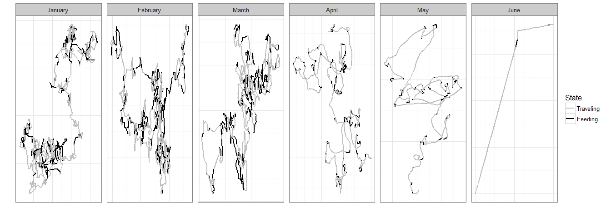
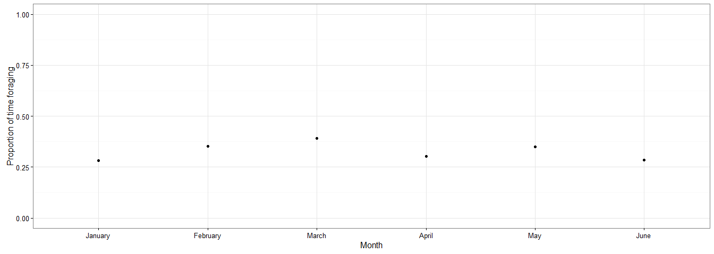
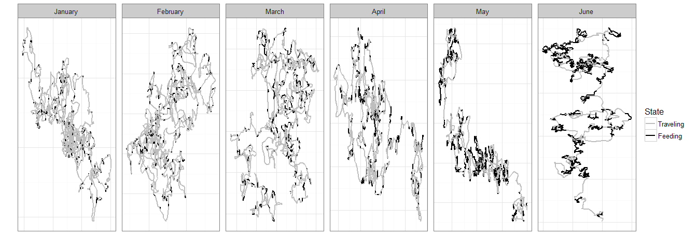
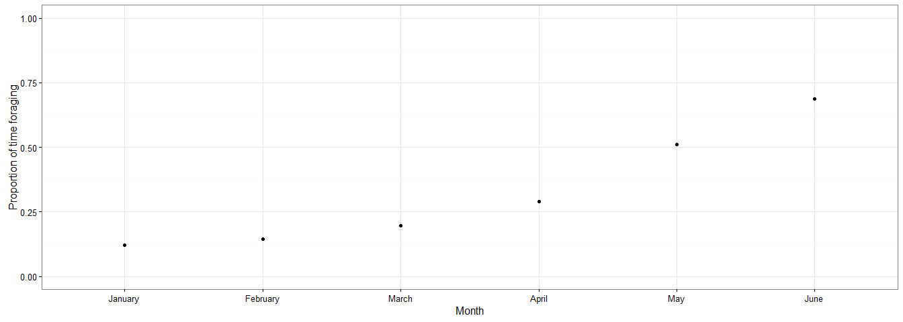

# The location, characteristics, and composition of temporal movement
Ben Weinstein  
November 3, 2016  

#Changes in movement location

# Changes in movement characteristics

## Increasing autocorrelation in traveling over time. 

<!-- --><!-- -->

## Increasing foraging allocation over time

<!-- --><!-- -->

